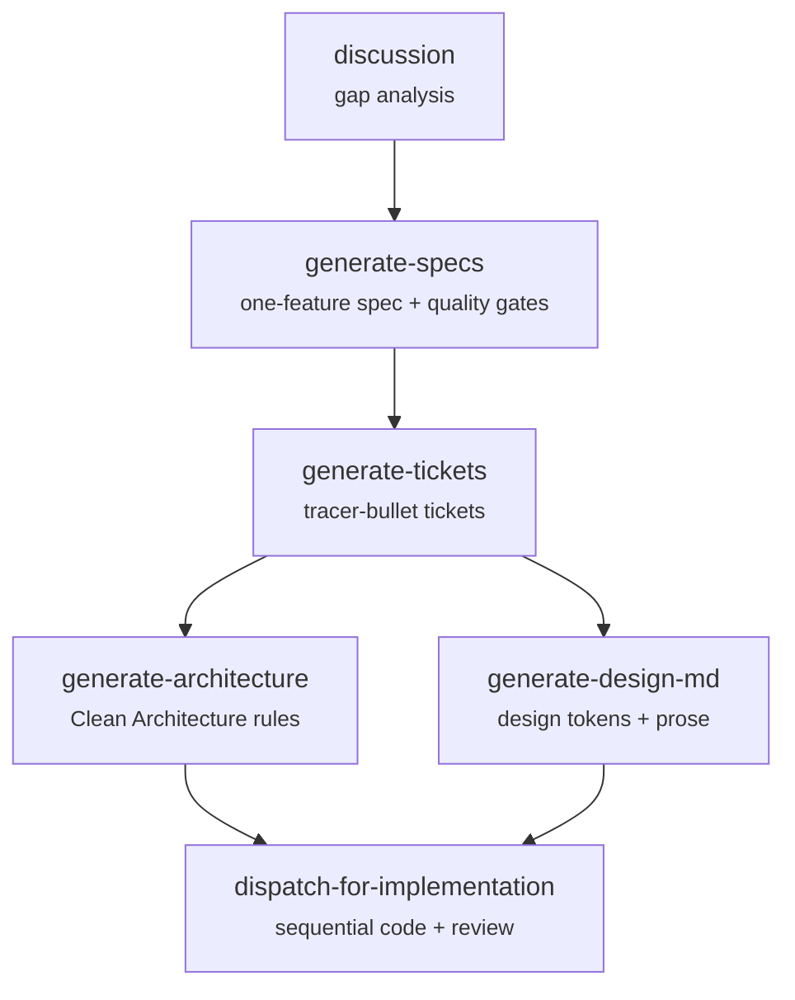

# Xzy Skills

[](https://skills.sh/sanxzy/skills)

A pipeline of composable agent skills that takes a rough idea from discussion through specification, ticket decomposition, architecture, design, and finally into implemented, reviewed, and merged code. No guesswork. No hand-waving. Every stage produces concrete, verifiable artifacts consumed by the next.

## Install

```bash
# Everything
npx skills add https://github.com/sanxzy/skills.git -a opencode --all

# Just what you need
npx skills add https://github.com/sanxzy/skills.git --skill discussion -a opencode
npx skills add https://github.com/sanxzy/skills.git --skill dispatch-for-implementation --skill generate-tickets -a opencode
```

## The Pipeline



## Skills

### discussion - Shape the idea before you build it.

Turns a rough thought into a well-mapped decision tree. A brainstormer agent cross-references the conversation against codebase context and project docs to surface gaps, hidden assumptions, and missing branches — before a single line of code gets written.

```
npx skills add https://github.com/sanxzy/skills.git --skill discussion -a opencode
```

**Agents:** 1 (`discussion-brainstormer`) &nbsp;·&nbsp; **Version:** 0.0.1

---

### generate-specs - One feature. One finalized spec.

Generates one engineering specification for exactly one explicitly selected feature from conversation context or a `features.md` artifact. A host coordinator resolves the feature, delegates codebase evidence gathering to `spec-scout`, applies quality gates, and writes `_xzy-ai/sprints/<backlog_name>/specs/features/<NNN>/spec.md` with resumable progress and archived revisions.

```
npx skills add https://github.com/sanxzy/skills.git --skill generate-specs -a opencode
```

**Agents:** 1 (`spec-scout`) &nbsp;·&nbsp; **Version:** 1.0.0

---

### generate-tickets - From spec to tracer bullets.

Decomposes a spec or plan into dependency-ordered tickets. Each ticket is a vertical slice with explicit blocking edges — the agent knows what must ship before what. Output is a single `ticket.md` that feeds directly into `dispatch-for-implementation`.

```
npx skills add https://github.com/sanxzy/skills.git --skill generate-tickets -a opencode
```

**Agents:** 3 (`discovery-agent`, `ticket-planning-agent`, `assembler-agent`) &nbsp;·&nbsp; **Version:** 0.1.0

---

### generate-architecture - The rules every agent follows.

Produces `_xzy-ai/architecture.md` — a canonical reference for Clean Architecture principles, layering, dependency direction, module boundaries, and directory layout. Every downstream agent reads this first. 11 languages, 10 project types.

```
npx skills add https://github.com/sanxzy/skills.git --skill generate-architecture -a opencode
```

**Version:** 0.1.0

---

### generate-design-md - The design language everyone speaks.

Produces `design.md` — YAML design tokens (colors via Material Color Utilities, typography scales, spacing grids) plus narrative prose across 12 categories. Platform-agnostic: web, mobile, desktop, TUI, embedded, kiosk.

```
npx skills add https://github.com/sanxzy/skills.git --skill generate-design-md -a opencode
```

**Version:** 1.0.0

---

### dispatch-for-implementation - Build it, review it, merge it.

The end of the pipeline. Takes a `ticket.md` and runs every work unit through a strict 6-agent sequence: worker implementation → ACS review → security review → quality gate → merge. Fully sequential — one work unit at a time, globally. Workers reject incomplete instructions. Reviewers independently verify source code, never trust reports. Nothing merges without passing all three gates.

```
npx skills add https://github.com/sanxzy/skills.git --skill dispatch-for-implementation -a opencode
```

**Agents:** 6 (`dispatch-code-worker`, `dispatch-code-with-ui-worker`, `dispatch-acs-reviewer`, `dispatch-security-reviewer`, `dispatch-quality-gate-reviewer`, `dispatch-worker-advisor`) &nbsp;·&nbsp; **Version:** 1.0.0

---

## Principles

**Strict contracts.** Every agent defines what it needs. If the coordinator delegates without providing required inputs, the agent rejects immediately — in plain text listing what's missing. No silent compensations. No guesswork.

**Independent verification.** Reviewers never trust implementation reports. They inspect the actual files — source code, config, tests, docs. They confirm behavior by reading the code itself.

**Sequential where it matters.** `dispatch-for-implementation` runs one work unit at a time globally. No concurrent workers, no merge serialization bugs, no worktree conflicts. Each unit goes from implementation through all three review gates before the next one starts.

**Deterministic over clever.** Every output has an explicit format. Every stage has a completion criterion. Every agent knows when it's done. Resume from the last checkpoint, not from the beginning.

**Composable, not monolithic.** Each skill does one thing well. Chain them. Skip them. Reorder them. Skills don't know about each other — they consume artifacts and produce artifacts.

## Utilities

### install-bundled-agents - Sync agents to your workspace.

Scans all locally available skills and installs their bundled agents into your chosen directory. Delegates the work to a single script. Idempotent — safe to run whenever you add or update skills.

```
npx skills add https://github.com/sanxzy/skills.git --skill install-bundled-agents -a opencode
```

**Version:** 1.0.0
