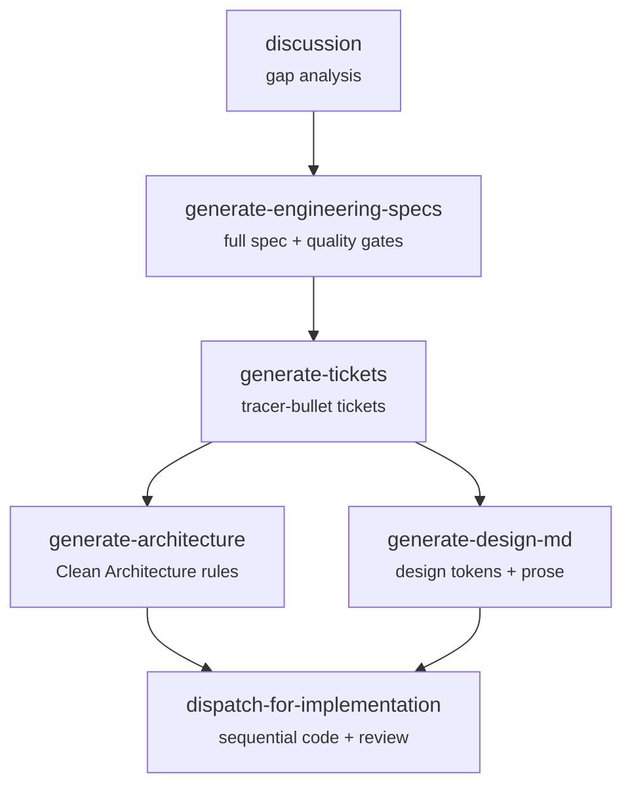

# Skills For Real Engineers

[](https://skills.sh/sanxzy/skills)

My agent skills that I use every day to do real engineering — not vibe coding.

These skills are designed to be small, composable, and deterministic. They work with any model. No interview-style guessing — just synthesize what you already know and execute with strict contracts. Every agent has a single responsibility, explicit required inputs, and a clear deliverable. Hack around with them. Make them your own. Enjoy.

## Quickstart (30-second setup)

```bash
# Install all skills
npx skills add https://github.com/sanxzy/skills.git -a opencode --all

# Install one skill
npx skills add https://github.com/sanxzy/skills.git --skill discussion -a opencode

# Install specific skills
npx skills add https://github.com/sanxzy/skills.git --skill dispatch-for-implementation --skill generate-tickets -a opencode
```

## Why These Skills Exist

Most approaches like GSD, BMAD, and Spec-Kit try to help by owning the process. They take away your control and make bugs hard to resolve.

These skills fix four common failure modes:

### #1: The Agent Didn't Do What I Want

**The Problem**: Agents misunderstand ambiguous requirements and produce wrong implementations. The fix is upfront alignment — getting the agent to ask you detailed questions before writing a single line.

**The Fix**: [`/discussion`](#discussion) — grills you relentlessly about every aspect of your plan until every branch of the decision tree is resolved. A brainstormer agent identifies gaps, hidden assumptions, and overlooked decisions.

### #2: The Architecture Is Inconsistent

**The Problem**: Every AI session reinvents the wheel. Without a shared architectural reference, agents make incompatible decisions across sessions, producing a fragmented codebase.

**The Fix**: [`/generate-architecture`](#generate-architecture) — generates a canonical `_xzy-ai/architecture.md` that every agent follows. Clean Architecture principles, dependency direction, module boundaries — all codified. [`/generate-design-md`](#generate-design-md) does the same for design tokens.

### #3: The Spec Is Vague

**The Problem**: A one-sentence feature request produces a one-sentence implementation. Without a rigorous spec, the agent guesses — and guesses wrong.

**The Fix**: [`/generate-engineering-specs`](#generate-engineering-specs) — a 4-agent pipeline that turns any conversation into a comprehensive specification with user stories, architecture decisions, testing seams, and quality gates. No interview. Just synthesis.

### #4: The Implementation Drifts

**The Problem**: Even with a great spec, agents drift. They skip tests. They ignore security. They introduce bugs that compound across work units. Without a strict implementation contract, quality collapses.

**The Fix**: [`/dispatch-for-implementation`](#dispatch-for-implementation) — a 6-agent sequential pipeline that enforces required-input contracts, TDD mode, 3 review gates (ACS → Security → Quality), and `--no-ff` merges. Workers reject incomplete instructions. Reviewers independently verify, never trust reports. One work unit at a time, globally.

### Summary

Software engineering fundamentals matter more than ever. These skills condense decades of engineering experience into repeatable, composable workflows. Every agent owns one responsibility. Every output is verified. Nothing ships without review.

---

## Reference

These split on one axis — **what they produce**.

### Discovery & Planning

Skills for understanding the problem space, aligning with users, and defining what to build.

**User-invoked — type these explicitly.**

| Skill | What it does | Install |
|-------|-------------|---------|
| [`discussion`](./discussion/SKILL.md) | Grills you relentlessly about every aspect of your plan until all branches of the decision tree are resolved. A brainstormer agent identifies gaps, assumptions, and overlooked decisions. | `npx skills add https://github.com/sanxzy/skills.git --skill discussion -a opencode` |

**Model-invoked — the agent reaches for these automatically.**

| Skill | What it does | Install |
|-------|-------------|---------|
| [`generate-engineering-specs`](./generate-engineering-specs/SKILL.md) | 4-agent pipeline that turns any conversation into a rigorous engineering spec: discovery → requirements → architecture → assembly. No interview — just synthesis. | `npx skills add https://github.com/sanxzy/skills.git --skill generate-engineering-specs -a opencode` |
| [`generate-tickets`](./generate-tickets/SKILL.md) | 3-agent pipeline that decomposes any plan, spec, or conversation into tracer-bullet tickets with blocking edges. Produces a consolidated `ticket.md` consumed by `dispatch-for-implementation`. | `npx skills add https://github.com/sanxzy/skills.git --skill generate-tickets -a opencode` |

### Architecture & Design

Skills for defining project-level conventions that every agent follows — the canonical source of truth.

**Model-invoked — the agent reaches for these automatically.**

| Skill | What it does | Install |
|-------|-------------|---------|
| [`generate-architecture`](./generate-architecture/SKILL.md) | Generates `_xzy-ai/architecture.md` — Clean Architecture principles, layering, dependency direction, module responsibilities. 11 languages, 10 project types. | `npx skills add https://github.com/sanxzy/skills.git --skill generate-architecture -a opencode` |
| [`generate-design-md`](./generate-design-md/SKILL.md) | Generates `design.md` — YAML design tokens plus narrative prose across 12 categories. Any platform: web, mobile, desktop, TUI, embedded. | `npx skills add https://github.com/sanxzy/skills.git --skill generate-design-md -a opencode` |

### Implementation

Skills that write, review, and ship code — strict contracts, sequential execution, independent verification.

**Model-invoked — the agent reaches for these automatically.**

| Skill | What it does | Install |
|-------|-------------|---------|
| [`dispatch-for-implementation`](./dispatch-for-implementation/SKILL.md) | 6-agent sequential pipeline: 2 workers (code + UI), 3 reviewers (ACS → Security → Quality), 1 advisor. Required-input contracts. TDD mode. `--no-ff` merges. One work unit at a time, globally. | `npx skills add https://github.com/sanxzy/skills.git --skill dispatch-for-implementation -a opencode` |

### Utilities

Support skills for managing the skills ecosystem itself.

| Skill | What it does | Install |
|-------|-------------|---------|
| [`install-bundled-agents`](./install-bundled-agents/SKILL.md) | Installs every agent bundled with locally available skills into the user-chosen agents directory. Idempotent — safe to run repeatedly. | `npx skills add https://github.com/sanxzy/skills.git --skill install-bundled-agents -a opencode` |

---

## Pipeline


