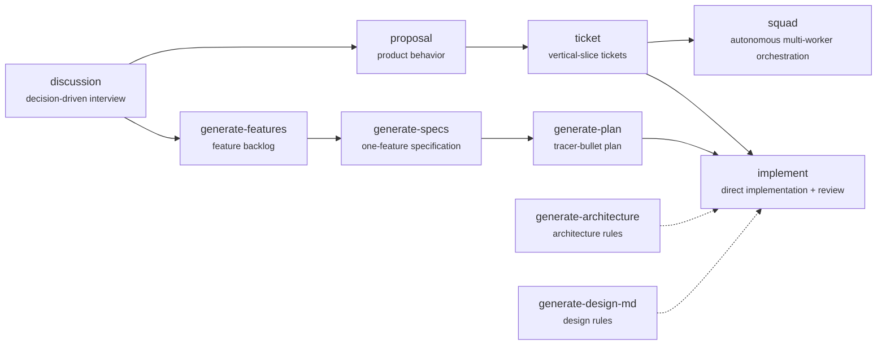

# Xzy Skills

[](https://skills.sh/sanxzy/skills)

A responsibility-organized collection of composable agent skills for discussion, product planning, architecture, implementation, media generation, document processing, and learning workflows. Skills communicate through explicit artifacts and verifiable contracts.

## Install

Install every skill:

```bash
npx skills add sanxzy/skills -a opencode --all
```

Install one or more skills by their `SKILL.md` frontmatter name:

```bash
npx skills add sanxzy/skills \
  --skill proposal \
  --skill ticket \
  --skill implement \
  --skill squad \
  -a opencode
```

The public skill name is independent of its responsibility folder. For example, the `proposal` skill is stored at `planning/v2/proposal/` but installed as `proposal`.

## Repository layout

```text
architecting/                  Architecture and design-system guidance
engineering/                   Direct and delegated implementation workflows
general/                       Repository and agent utilities
media/                         Visual, story, and image-prompt workflows
office/                        Office-document workflows
planning/v1/                   Feature, specification, and plan workflow
planning/v2/                   Proposal and ticket workflow
productivity/                  Conversation and learning workflows
```

Every skill is self-contained under its responsibility folder:

```text
<responsibility>/<skill-name>/           # or <responsibility>/<version>/<skill-name>/
├── SKILL.md
├── _agents/       # optional bundled subagents
├── agents/        # optional platform metadata
├── references/    # optional supporting contracts
├── scripts/       # optional executable helpers
└── examples/      # optional examples
```

## Planning and implementation pipeline

The repository contains two planning tracks. Choose the track that matches the source artifact you have, then use `implement` for direct execution or `squad` for delegated multi-worker execution.



- `planning/v1/` provides the `generate-features → generate-specs → generate-plan` workflow.
- `planning/v2/` provides the `proposal → ticket` workflow.
- `engineering/implement/` consumes either a canonical plan or a ticket set, implements one unit at a time, verifies it, and gates it with `impl-reviewer` before commit.
- `engineering/squad/` consumes one canonical ticket set and coordinates dedicated workers, reviewers, run-level QA, durable recovery, and controlled integration.
- `architecting/` provides optional architecture and design references for downstream work.
- `media/`, `office/`, and `productivity/` contain independent workflows and do not require the planning pipeline.

## Skill catalog

### Architecting

| Skill | Path | Purpose |
| --- | --- | --- |
| `generate-architecture` | `architecting/generate-architecture/` | Generate `_xzy-ai/architecture.md` with principle-driven layers, boundaries, dependency direction, and adoption guidance. |
| `generate-design-md` | `architecting/generate-design-md/` | Generate `_xzy-ai/design.md` with implementation-agnostic design tokens and UI rules. |

### Engineering

| Skill | Path | Purpose |
| --- | --- | --- |
| `implement` | `engineering/implement/` | Implement unfinished plan phases or tickets directly in the current checkout, verify them, and run the persistent reviewer gate. |
| `squad` | `engineering/squad/` | Autonomously orchestrate one canonical ticket set through dedicated workers, independent reviewers, run-level QA, durable recovery, and controlled integration. |

### General

| Skill | Path | Purpose |
| --- | --- | --- |
| `install-bundled-agents` | `general/install-bundled-agents/` | Synchronize bundled agents into a user-selected agent directory. |

### Media

| Skill | Path | Purpose |
| --- | --- | --- |
| `canvas-design` | `media/canvas-design/` | Create visual philosophies and express them as original PNG or PDF artwork. |
| `character-design` | `media/character-design/` | Create production-ready character design sheet prompts from briefs and optional visual references. |
| `story-page` | `media/story-page/` | Create a single narrative story-page image prompt with explicit visual continuity. |
| `storyboard` | `media/storyboard/` | Create a composite storyboard-sheet prompt for narrative and cinematic sequences. |

### Office

| Skill | Path | Purpose |
| --- | --- | --- |
| `docx` | `office/docx/` | Create, read, edit, validate, and transform Word documents and templates. |
| `pdf` | `office/pdf/` | Read, create, edit, extract, convert, validate, and fill PDF documents and forms. |
| `pptx` | `office/pptx/` | Create, read, edit, validate, and render PowerPoint presentations and templates. |
| `xlsx` | `office/xlsx/` | Create, read, edit, recalculate, validate, and analyze spreadsheets. |

### Planning v1

| Skill | Path | Purpose |
| --- | --- | --- |
| `generate-features` | `planning/v1/generate-features/` | Generate a durable product feature backlog from clarified context and targeted codebase discovery. |
| `generate-specs` | `planning/v1/generate-specs/` | Generate or resume one finalized engineering specification for one selected feature. |
| `generate-plan` | `planning/v1/generate-plan/` | Generate or resume one finalized tracer-bullet implementation plan for one selected feature. |

### Planning v2

| Skill | Path | Purpose |
| --- | --- | --- |
| `proposal` | `planning/v2/proposal/` | Turn an established product idea into one clear, behavior-first proposal. |
| `ticket` | `planning/v2/ticket/` | Turn one finalized proposal into dependency-ordered, independently verifiable implementation tickets. |

### Productivity

| Skill | Path | Purpose |
| --- | --- | --- |
| `discussion` | `productivity/discussion/` | Conduct a thorough, decision-driven interview until the outcome is clear and agreed. |
| `teach` | `productivity/teach/` | Teach a new skill or concept through a structured learning workspace. |

## Working principles

**Explicit contracts.** Each skill defines its inputs, outputs, boundaries, and completion criteria.

**Independent verification.** Reviewers inspect the actual files and behavior instead of trusting implementation summaries.

**Artifact-driven composition.** Downstream skills consume durable artifacts such as proposals, tickets, plans, architecture references, and design specifications.

**Sequential where it matters.** Implementation units are processed in dependency order, verified, reviewed, and completed before the next unit begins.

**Deterministic and resumable.** Workflows persist enough state and evidence to resume from the last verified checkpoint.

**Responsibility-oriented structure.** Folder placement communicates purpose; each skill owns its instructions, references, agents, scripts, and examples.
