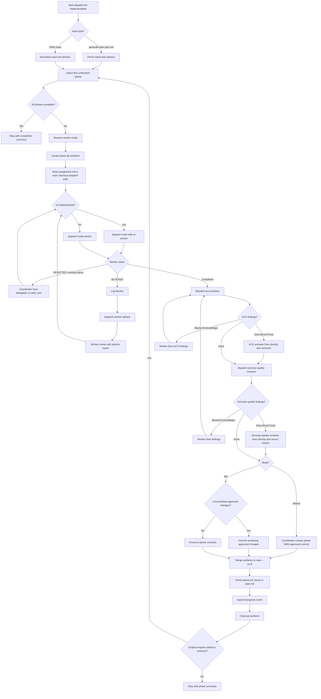
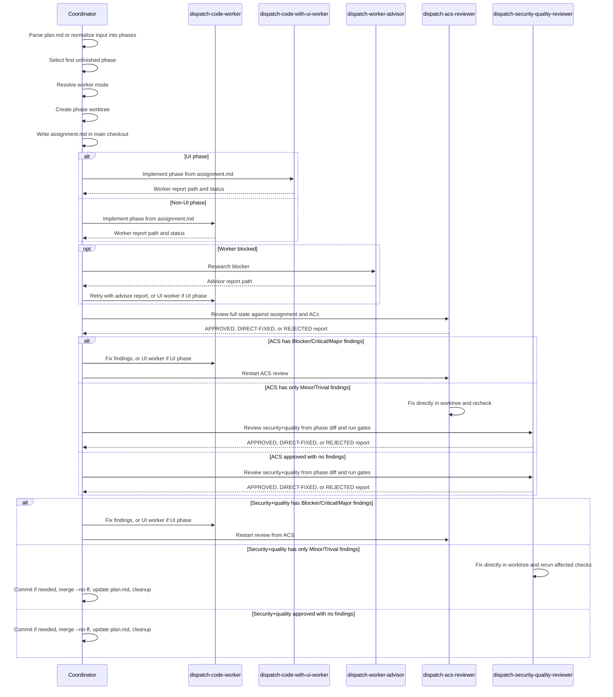

# Dispatch Workflow

```mermaid
flowchart TD
    A[Start dispatch-for-implementation] --> B{Input type?}

    B -->|generate-plan plan.md| C[Parse native plan phases]
    B -->|Other input| D[Normalize input into phases]

    C --> E[Select first unfinished phase]
    D --> E
    E --> F{All phases complete?}
    F -->|Yes| G[Stop with completion summary]
    F -->|No| H[Resolve worker mode]

    H --> I[Create phase git worktree]
    I --> J[Write assignment.md in main checkout dispatch path]
    J --> K{UI-related phase?}

    K -->|Yes| L[dispatch-code-with-ui-worker]
    K -->|No| M[dispatch-code-worker]

    L --> N{Worker status}
    M --> N

    N -->|REJECTED: missing inputs| O[Coordinator fixes delegation or asks user]
    O --> K

    N -->|BLOCKED| P[Log blocker]
    P --> Q[dispatch-worker-advisor]
    Q --> R[Worker retries with advisor report]
    R --> K

    N -->|Completed| S[dispatch-acs-reviewer]
    S --> T{ACS findings?}
    T -->|Only Minor/Trivial| MT[ACS reviewer fixes directly and rechecks]
    MT --> V[dispatch-security-quality-reviewer]
    T -->|None| V
    T -->|Blocker/Critical/Major| U[Worker fixes ACS findings]
    U --> S

    V --> W{Security+quality findings?}
    W -->|Only Minor/Trivial| QT[Security+quality reviewer fixes directly and reruns checks]
    QT --> Y{Mode?}
    W -->|None| Y
    W -->|Blocker/Critical/Major| X[Worker fixes findings]
    X --> S
    Y -->|default| Z[Coordinator creates phase NNN approved commit]
    Y -->|tdd| AA{Uncommitted approved changes?}
    AA -->|Yes| AB[Commit remaining approved changes]
    AA -->|No| AC[Preserve phase commits]
    Z --> AD[Merge worktree to main --no-ff]
    AB --> AD
    AC --> AD

    AD --> AE[Check phase AC boxes in plan.md]
    AE --> AF[Append progress event]
    AF --> AG[Cleanup worktree]
    AG --> AH{Original request asked to continue?}
    AH -->|Yes| E
    AH -->|No| AI[Stop with phase summary]
```

## Handoff Sequence

```mermaid
sequenceDiagram
    participant C as Coordinator
    participant CW as dispatch-code-worker
    participant UI as dispatch-code-with-ui-worker
    participant ADV as dispatch-worker-advisor
    participant ACS as dispatch-acs-reviewer
    participant SQ as dispatch-security-quality-reviewer

    C->>C: Parse plan.md or normalize input into phases
    C->>C: Select first unfinished phase
    C->>C: Resolve worker mode
    C->>C: Create phase worktree
    C->>C: Write assignment.md in main checkout

    alt UI phase
        C->>UI: Implement phase from assignment.md
        UI-->>C: Worker report path and status
    else Non-UI phase
        C->>CW: Implement phase from assignment.md
        CW-->>C: Worker report path and status
    end

    opt Worker blocked
        C->>ADV: Research blocker
        ADV-->>C: Advisor report path
        C->>CW: Retry with advisor report, or UI worker if UI phase
    end

    C->>ACS: Review full state against assignment and ACs
    ACS-->>C: APPROVED, DIRECT-FIXED, or REJECTED report

    alt ACS has Blocker/Critical/Major findings
        C->>CW: Fix findings, or UI worker if UI phase
        C->>ACS: Restart ACS review
    else ACS has only Minor/Trivial findings
        ACS->>ACS: Fix directly in worktree and recheck
        C->>SQ: Review security+quality from phase diff and run gates
        SQ-->>C: APPROVED, DIRECT-FIXED, or REJECTED report
    else ACS approved with no findings
        C->>SQ: Review security+quality from phase diff and run gates
        SQ-->>C: APPROVED, DIRECT-FIXED, or REJECTED report
    end

    alt Security+quality has Blocker/Critical/Major findings
        C->>CW: Fix findings, or UI worker if UI phase
        C->>ACS: Restart review from ACS
    else Security+quality has only Minor/Trivial findings
        SQ->>SQ: Fix directly in worktree and rerun affected checks
        C->>C: Commit if needed, merge --no-ff, update plan.md, cleanup
    else Security+quality approved with no findings
        C->>C: Commit if needed, merge --no-ff, update plan.md, cleanup
    end
```
