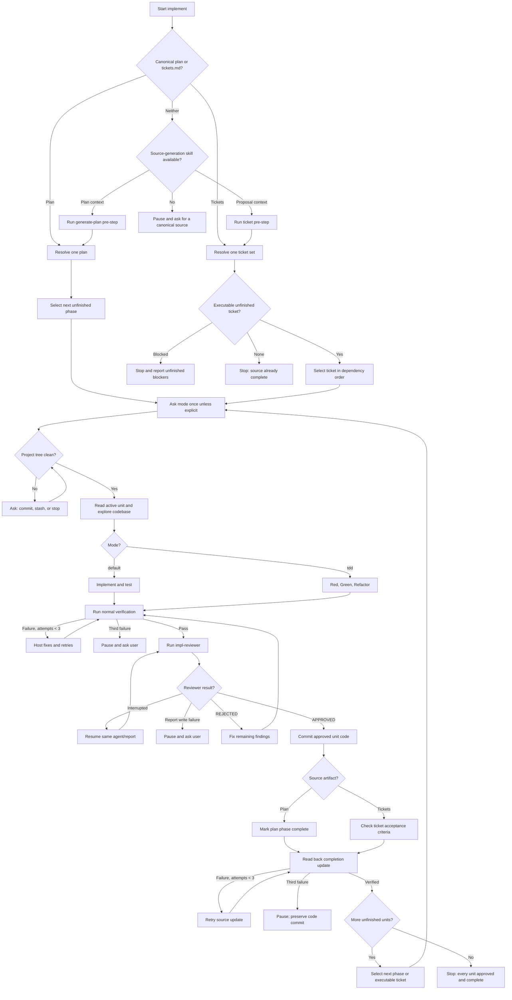

# Implement Workflow



## Plan-or-ticket workflow

1. Resolve the workspace and project root.
2. Select exactly one canonical source artifact:
   - a plan at `_xzy-ai/sprints/<backlog>/plans/features/<NNN>/plan.md`; or
   - a ticket index at `_xzy-ai/sprints/<backlog>/tickets.md`.
3. If no source exists, use `generate-plan` for plan context or `ticket` for proposal context as a separate pre-step. If the required source-generation skill is unavailable, pause and ask for a canonical source.
4. Resolve missing source identity, outcome, actors, scope, dependencies, or acceptance criteria through the existing context/discussion gate. Do not guess.
5. Continue only after the selected source artifact and its completion contract have been written and verified.

Do not silently combine a plan and ticket set. If both exist and the user did not name one, ask which source governs this implementation run.

## Source resolution

### Plan mode

1. Read `_xzy-ai/sprints/<backlog>/plans/features/<NNN>/plan.md`.
2. Extract the feature identity, architectural decisions, phase order, user stories, `What to build`, and acceptance criteria.
3. Select the explicitly named phase or the first unfinished phase.
4. Skip a phase only when all of its acceptance criteria are checked.
5. If all phases are complete, stop without a commit.

### Ticket mode

1. Read `_xzy-ai/sprints/<backlog>/tickets.md`.
2. Resolve every ticket link under `_xzy-ai/sprints/<backlog>/tickets/` and validate that IDs, titles, filenames, traceability, `Blocked by`, `Unblocks`, scope, and acceptance criteria agree with the index.
3. Select the explicitly named `TNNN` or the first unfinished ticket in the index's dependency order whose ticket blockers all have checked acceptance criteria and whose external prerequisites are explicitly satisfied.
4. Do not bypass an unfinished blocker or assume an external prerequisite is satisfied. If tickets remain but none is executable, stop and report the blocker IDs or external prerequisites.
5. If all ticket acceptance criteria are checked, stop without a commit.
6. A ticket may be small even when the ticket set is long. Never combine multiple tickets into one implementation unit.

## Implementation-unit cycle

For each selected phase or ticket, work only on that unit until it is approved and complete:

1. Resolve the unit and record the baseline SHA before changing code.
2. Ask for `default` or `tdd` once at the start of the run when no mode was explicitly supplied. Apply it to every unit unless a unit-specific override is explicit.
3. Inspect `git status`. Existing project-root changes must be handled by asking the user to commit, stash, or stop. Begin only with a clean project-root tree; pre-existing workspace `_xzy-ai/` artifacts are excluded.
4. Read the unit's complete contract:
   - plan mode: user stories, `What to build`, architectural decisions, and acceptance criteria;
   - ticket mode: `What to build`, proposal traceability, scope boundary, `Blocked by`, and acceptance criteria.
5. Read architecture guidance, repository instructions, source patterns, relevant tests, and normal verification commands.
6. Implement directly in the project-root checkout.
7. For functional units, add or update behavior-focused tests with an oracle independent from the implementation; tautological tests do not count. Name every new or renamed project-owned test file for the subject and behavior it verifies, following the repository's convention. Never use phase, feature, ticket, review, TDD-state, or attempt metadata in that filename (for example, do not create `phase3-events.test.ts` or `phase13-review010.test.ts`); extend an existing semantic test file when appropriate. Reviewer-isolated audit tests are the only exception and use `attempt-<NN>-<semantic-slug>.<ext>` so the slug remains behavior-oriented. Where the contract promises a stable shape or type, vary same-type/category values and assert type-preserving structural invariance without requiring exact dynamic values, including but not limited to IDs, salted/randomized hashes, or randomized encryption/ciphertext. For scaffolding, run applicable syntax/build/config checks.
8. Run normal project verification. If no command is identifiable, try build, lint, typecheck, then a user-defined command. Ask if none applies.
9. Retry a failing normal verification up to three self-fix attempts. Do not commit failing work.
10. Run `impl-reviewer` before committing the unit. Pass `baseline_sha`, `project_root`, `source_kind`, absolute `source_path`, `backlog`, `feature` (`none` for ticket mode), `unit_id`, `mode`, previous progress, and current progress/status. Do not pass a direct contract or report path.
11. If the reviewer returns `REJECTED`, fix every remaining finding, rerun normal verification, and resume the same reviewer agent ID for a new review attempt. Repeat until it explicitly returns `verdict: APPROVED`.
12. If the reviewer is interrupted, resume the same agent ID and same report up to three times. If it still stops, pause and ask the user. If report persistence fails after the reviewer's three write/read-back retries, pause and ask the user; never use an inline-only approval.
13. After `APPROVED`, commit the unit code/TDD changes, including reviewer direct fixes. Reviewer reports remain workspace-local and are not committed.
14. Update the source artifact separately:
    - plan mode: check the completed phase criteria/status in `plan.md`;
    - ticket mode: check every completed acceptance criterion in the selected ticket file without changing dependency edges or scope.
15. Read back and verify the source update. Retry it up to three times; if it remains unsuccessful, preserve the code commit, do not advance, and ask the user.
16. Begin the next phase or executable ticket only after both the code commit and source update succeed.

## Reviewer report lifecycle

The reviewer derives its report path from the source kind and unit:

```text
Plan mode:
_xzy-ai/sprints/<backlog>/implement/<feature>/reviews/impl-reviewer/phase-<phase>/report-<NN>.md

Ticket mode:
_xzy-ai/sprints/<backlog>/implement/tickets/reviews/impl-reviewer/ticket-<TNNN>/report-<NN>.md
```

The report starts as `Status: IN_PROGRESS` and `Verdict: PENDING`. It stores source metadata, the active unit contract, full review evidence, findings, and direct fixes incrementally. A completed report transitions to `Status: COMPLETE` with `Verdict: APPROVED` or `REJECTED` and is read back before the reviewer returns:

```text
report_path: <absolute report path>
verdict: APPROVED | REJECTED
```

A resumed interruption continues the same report. A new post-fix review attempt uses the next zero-padded report number. Invalid inputs are rejected before report creation; report-write failures are not converted into acceptance findings or inline approval.

## Input selection

### Explicit source

If the user provides a plan path, use plan mode. If the user provides `tickets.md` or a ticket path, use ticket mode and resolve the parent index. If the user names a feature, phase, or ticket, use it to disambiguate candidates.

### Discovery without an explicit source

1. Find canonical plans and ticket indexes under `_xzy-ai/sprints/`.
2. If exactly one source artifact exists, use it.
3. If multiple source artifacts exist, ask the user to choose; never infer from modification time.
4. If no source artifact exists, use the appropriate source-generation skill according to the user's context or pause.

## Recovery

- Normal verification failures: up to three host self-fix attempts.
- Reviewer interruption: resume the same agent ID and same report up to three times, then pause for the user.
- Reviewer report writes/read-backs: up to three immediate attempts without sleeping, then pause for the user.
- Plan or ticket completion update: up to three write/read-back attempts after the code commit, then pause for the user.
- Ticket selection: never skip an unfinished blocker; resume only after the source artifact shows the blocker complete.

## Completion

Continue the implementation-unit cycle until every plan phase or current ticket is approved, committed, and marked complete. Then stop with a concise completion summary identifying the source kind, source path, completed unit count, and any remaining blocked units.
