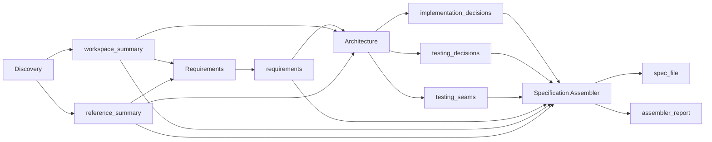

# Contract Format

Defines the standard agent output contract schema, field definitions, per-agent deliverable schemas, dependency declarations, examples, and validation rules. Every agent in the `generate-engineering-specs` workflow must return a YAML document conforming to this contract.

## Agent Output Contract Schema

Every agent returns a single YAML document with the following top-level structure:

```yaml
status: <string>
confidence: <integer>
deliverables:
  <agent-specific-key>: <value>
missing_information:
  - <string>
assumptions:
  - <string>
questions_for_user:
  - <string>
blocking_issues:
  - <string>
recommendations:
  - <string>
```

## Field Definitions

### `status`

| Value | Meaning | Required |
|-------|---------|----------|
| `success` | Agent completed its work fully | yes |
| `partial` | Agent completed partially; missing information or blockers exist | yes |
| `failed` | Agent could not complete its work | yes |

Must be exactly one of these three values.

### `confidence`

- **Type:** integer
- **Range:** 0–100
- **Required:** yes
- Represents the agent's self-assessed confidence in its output. 0 = completely uncertain, 100 = fully certain.
- Confidence thresholds used by the coordinator (see VALIDATION-CRITERIA.md §Confidence Thresholds):
  - `>= 80`: PASS — immediate proceed to next phase
  - `70–79`: LOW_PASS — proceed with coordinator annotation
  - `< 70`: FAIL — retry the agent with enhanced context
  - `< 50`: CRITICAL_FAIL — escalate to user, do not retry automatically

### `deliverables`

- **Type:** object
- **Required:** yes
- **Must not be empty** when `status` is `success`.
- Keys and value types are agent-specific (see Per-Agent Deliverable Schemas below).
- Values are either:
  - **file paths** (string) — paths are **relative to `_xzy-ai/sprints/<backlog_name>/specs/`**
  - **inline content** (string or array) — raw text embedded directly in the contract

### `missing_information`

- **Type:** array of strings
- **Required:** conditional — must be non-empty when `status` is `partial` or `failed`
- Each string describes a specific piece of information the agent could not determine.

### `assumptions`

- **Type:** array of strings
- **Required:** no (should be empty list if none)
- Each string records an assumption the agent made to proceed despite uncertainty.

### `questions_for_user`

- **Type:** array of strings
- **Required:** no (should be empty list if none)
- When non-empty, the coordinator pauses execution and presents questions to the user one at a time.

### `blocking_issues`

- **Type:** array of strings
- **Required:** conditional — must be non-empty when `status` is `failed`
- Each string describes an issue that prevents the agent from completing its work.

### `recommendations`

- **Type:** array of strings
- **Required:** no (should be empty list if none)
- Suggestions for downstream agents or the coordinator (e.g., "consider revisiting the problem statement", "this agent should be re-run after the API contract is finalized").

## Per-Agent Deliverable Schemas

### Discovery Agent

```yaml
deliverables:
  workspace_summary: <string>   # file path: workspace-summary.md
  reference_summary: <string>   # file path: reference-summary.md
```

- `workspace_summary`: path relative to `specs/`, written as markdown. Contains codebase exploration findings: greenfield/brownfield determination, architecture overview, domain glossary, existing patterns, relevant files.
- `reference_summary`: path relative to `specs/`, written as markdown. Contains reference research: best practices, similar implementations, library recommendations, ADR summaries.

### Requirements Agent

```yaml
deliverables:
  requirements: <string>        # file path: requirements.md
  problem_statement: <string>   # inline
  solution: <string>            # inline
  user_stories:                 # inline
    - <string>
  out_of_scope:                 # inline
    - <string>
```

- `requirements`: path relative to `specs/`, written as markdown. Full requirements document including functional and non-functional requirements, edge cases, dependencies.
- `problem_statement`: inline string — one or two paragraphs defining the problem being solved.
- `solution`: inline string — high-level description of the proposed solution.
- `user_stories`: inline array of strings — each string is a complete user story in standard format ("As a... I want... So that...").
- `out_of_scope`: inline array of strings — explicitly excluded items, future considerations.

### Architecture Agent

```yaml
deliverables:
  implementation_decisions: <string>   # file path: implementation-decisions.md
  testing_decisions: <string>          # file path: testing-decisions.md
  testing_seams:                       # inline
    - name: <string>
      type: <string>
      rationale: <string>
```

- `implementation_decisions`: path relative to `specs/`, written as markdown. Architecture decisions, API contracts, schema designs, module boundaries, data flow, integration points.
- `testing_decisions`: path relative to `specs/`, written as markdown. Testing strategy, test levels, tooling choices, environment setup.
- `testing_seams`: inline array of objects — testing seams identified during architecture analysis. Each seam has:
  - `name`: identifier for the seam (e.g., "repository-interface", "auth-middleware")
  - `type`: one of `interface`, `mock`, `fake`, `spy`, `stub`, `contract-test`, `integration-point`
  - `rationale`: why this seam was chosen and how it enables testability

### Specification Assembler

```yaml
deliverables:
  spec_file: <string>            # file path: spec.md
  assembler_report: <string>     # file path: assembler-report.md
  consistency_issues:            # inline
    - <string>
```

- `spec_file`: path relative to `_xzy-ai/sprints/<backlog_name>/`, written as markdown. Final merged specification document. This is the skill's primary output.
- `assembler_report`: path relative to `specs/`, written as markdown. Report detailing merge decisions, conflicts resolved, sections sourced from which upstream agents.
- `consistency_issues`: inline array of strings — any contradictions or inconsistencies detected during assembly (may be empty).

## Agent Dependency Declarations

Each agent explicitly declares what it requires as input and what it produces as output. This enables the coordinator to validate dependencies, detect missing artifacts, and determine what to re-run on resume.

### Discovery Agent

| Direction | Artifacts |
|-----------|-----------|
| **requires** | *(nothing)* — receives only conversation context |
| **produces** | `workspace_summary`, `reference_summary` |

### Requirements Agent

| Direction | Artifacts |
|-----------|-----------|
| **requires** | `workspace_summary`, `reference_summary` |
| **produces** | `requirements` |

### Architecture Agent

| Direction | Artifacts |
|-----------|-----------|
| **requires** | `workspace_summary`, `reference_summary`, `requirements` |
| **produces** | `implementation_decisions`, `testing_decisions`, `testing_seams` |

### Specification Assembler

| Direction | Artifacts |
|-----------|-----------|
| **requires** | `workspace_summary`, `reference_summary`, `requirements`, `implementation_decisions`, `testing_decisions`, `testing_seams` |
| **produces** | `spec_file`, `assembler_report`, `consistency_issues` |

### Dependency Flow



## Examples

### Well-Formed Contract: Discovery Agent

```yaml
status: success
confidence: 88
deliverables:
  workspace_summary: workspace-summary.md
  reference_summary: reference-summary.md
missing_information:
  - "No ADR documents found in the repository"
  - "Existing test framework could not be determined"
assumptions:
  - "Project uses Express.js based on package.json dependencies"
  - "MongoDB is the primary datastore based on connection strings in config/"
questions_for_user:
  - "Should we continue using the existing test framework (mocha) or migrate to jest?"
blocking_issues: []
recommendations:
  - "Consider adding an ADR for database selection before implementation phase"
```

### Malformed Contract: Discovery Agent

```yaml
status: ok                  # INVALID: must be 'success' | 'partial' | 'failed'
confidence: 0.88            # INVALID: must be integer 0-100, not float
deliverables:
  workspace_summary: workspace-summary.md
  # MISSING: reference_summary
missing_information: []     # INVALID: must list what's missing when workspace findings are incomplete
assumptions:                # VALID format, but missing key assumptions
  - "Everything works fine"
blocking_issues: []         # VALID
recommendations: []         # VALID
  # MISSING: questions_for_user key entirely
```

Validation errors in the malformed example:
1. `status: ok` is not a valid status value
2. `confidence` is a float; must be integer 0–100
3. `deliverables` is missing `reference_summary` — required for Discovery Agent
4. `missing_information` is empty despite `workspace_summary` referencing incomplete findings
5. No explicit `questions_for_user` key (should be present, even if empty)

### Well-Formed Contract: Architecture Agent

```yaml
status: success
confidence: 92
deliverables:
  implementation_decisions: implementation-decisions.md
  testing_decisions: testing-decisions.md
  testing_seams:
    - name: payment-gateway-interface
      type: interface
      rationale: "Payment provider is a third-party dependency; defining a seam allows swapping providers and testing in isolation"
    - name: auth-middleware
      type: mock
      rationale: "Authentication middleware can be mocked in integration tests to avoid real auth setup"
    - name: database-repository
      type: contract-test
      rationale: "Repository layer should be verified with contract tests against a test database"
missing_information: []
assumptions:
  - "Stripe will be the initial payment provider based on requirements reference"
questions_for_user:
  - "The testing seam for payment-gateway-interface proposes contract tests. Do you approve this approach?"
blocking_issues: []
recommendations:
  - "Implementation should start with the repository layer to enable testing from the ground up"
```

## Contract Validation Rules

The coordinator performs these checks against every agent output before accepting it.

### 1. Structure Validation

| Rule | Condition | Error |
|------|-----------|-------|
| 1.1 | Output must be parseable as YAML | `invalid_yaml` |
| 1.2 | Top-level keys must include `status`, `confidence`, `deliverables`, `missing_information`, `assumptions`, `questions_for_user`, `blocking_issues`, `recommendations` | `missing_keys` |
| 1.3 | No extra top-level keys beyond the contract schema | `extra_keys` |

### 2. Status Validation

| Rule | Condition | Error |
|------|-----------|-------|
| 2.1 | `status` must be one of `success`, `partial`, `failed` | `invalid_status` |
| 2.2 | If `status` is `partial` or `failed`, `missing_information` or `blocking_issues` must be non-empty | `incomplete_without_info` |

### 3. Confidence Validation

| Rule | Condition | Error |
|------|-----------|-------|
| 3.1 | `confidence` must be an integer | `confidence_not_integer` |
| 3.2 | `confidence` must be between 0 and 100 inclusive | `confidence_out_of_range` |
| 3.3 | If `status` is `success`, `confidence` should be >= 70 | `low_confidence_success` (warning, not error) |

### 4. Deliverables Validation

| Rule | Condition | Error |
|------|-----------|-------|
| 4.1 | `deliverables` must not be null or empty when `status` is `success` | `empty_deliverables` |
| 4.2 | All required deliverable keys for the agent must be present (see Per-Agent Deliverable Schemas) | `missing_deliverable` |
| 4.3 | File-path deliverables must be non-empty strings | `invalid_deliverable_path` |

### 5. Array Validation

| Rule | Condition | Error |
|------|-----------|-------|
| 5.1 | `missing_information`, `assumptions`, `questions_for_user`, `blocking_issues`, `recommendations` must all be arrays | `field_not_array` |
| 5.2 | Each element in these arrays must be a non-empty string | `empty_array_element` |

### 6. Validation Outcome

| Result | Coordinator Action |
|--------|-------------------|
| All rules pass | Accept output, persist contract to metadata YAML, proceed to next agent |
| Warnings only (e.g., low confidence on success) | Accept output, log warning, proceed |
| Errors with retryable rules (missing deliverable, low confidence, partial with info) | Reject output, retry agent with specific guidance |
| Errors with fatal rules (invalid status, invalid YAML, failed without blockers) | Reject output, abort workflow, preserve partial artifacts |

### Validation Pseudocode

```
function validate_contract(output, agent_type):
    errors = []
    warnings = []

    if not is_parseable_yaml(output):
        return { valid: false, errors: ["invalid_yaml"], fatal: true }

    for field in [status, confidence, deliverables, missing_information, 
                  assumptions, questions_for_user, blocking_issues, recommendations]:
        if field not in output:
            errors.append("missing_keys: " + field)

    if output.status not in ["success", "partial", "failed"]:
        errors.append("invalid_status: " + output.status)

    if output.status in ["partial", "failed"]:
        if is_empty(output.missing_information) and is_empty(output.blocking_issues):
            errors.append("incomplete_without_info")

    if type(output.confidence) != int or output.confidence < 0 or output.confidence > 100:
        errors.append("confidence_out_of_range")

    if output.status == "success" and output.confidence < 70:
        warnings.append("low_confidence_success")

    if is_empty(output.deliverables):
        if output.status == "success":
            errors.append("empty_deliverables")
    else:
        required = required_deliverables_for(agent_type)
        for key in required:
            if key not in output.deliverables:
                errors.append("missing_deliverable: " + key)

    for array_field in [missing_information, assumptions, questions_for_user,
                        blocking_issues, recommendations]:
        if type(output[array_field]) != list:
            errors.append("field_not_array: " + array_field)

    return {
        valid: len(errors) == 0,
        errors: errors,
        warnings: warnings,
        fatal: any_error_is_fatal(errors)
    }
```
