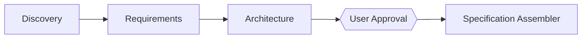

# Validation Criteria

Defines the three-tier validation framework, per-agent validation gates, confidence thresholds, retry policy, and coordinator decision matrix. The coordinator uses these criteria to validate every agent output before accepting it and proceeding to the next phase.

## Validation Framework

Every agent output is validated against three tiers. A later tier is only checked if all earlier tiers pass.

### Tier 1: Contract Compliance

Validates that the agent output conforms to the YAML schema defined in [CONTRACT-FORMAT.md](./CONTRACT-FORMAT.md).

| Check | Description |
|-------|-------------|
| Parseable YAML | Output must be valid YAML |
| Required keys | Must include `status`, `confidence`, `deliverables`, `missing_information`, `assumptions`, `questions_for_user`, `blocking_issues`, `recommendations` |
| Extra keys | No top-level keys beyond the contract schema |
| Valid status | One of `success`, `partial`, `failed` |
| Valid confidence | Integer 0–100 |
| Required deliverables | All agent-specific deliverable keys present (see CONTRACT-FORMAT.md per-agent schemas) |
| Array fields | `missing_information`, `assumptions`, `questions_for_user`, `blocking_issues`, `recommendations` must be arrays |
| Non-empty strings | All array elements and deliverable paths must be non-empty strings |
| Status consistency | `partial`/`failed` must have non-empty `missing_information` or `blocking_issues`; `success` must have non-empty `deliverables` |

### Tier 2: Content Quality

Validates that the deliverable content is substantive and meaningful.

| Check | Description |
|-------|-------------|
| Minimum length | Referenced files must exist and contain substantive content (not empty, not placeholder text) |
| Specificity | Content must reference specific codebase elements, decisions, or rationale — not generic statements |
| Actionability | Deliverables must enable the next agent to proceed without guessing |
| No placeholders | No "TODO", "TBD", "to be determined", or similar unresolved markers |

### Tier 3: Consistency

Validates that the output is consistent with upstream agent outputs.

| Check | Description |
|-------|-------------|
| Terminology match | Key terms and names used must match those established by upstream agents |
| No contradictions | Decisions must not conflict with upstream decisions |
| Dependency traceability | Every claim about the workspace or requirements must be traceable to an upstream deliverable |
| Assumption alignment | Assumptions must not contradict assumptions documented by upstream agents |

## Per-Agent Validation Gates

### Discovery Agent

After Tier 1–3 pass, the coordinator checks these content-specific criteria:

| Gate | Pass Condition | Fail Action |
|------|---------------|-------------|
| Project type | Must explicitly state `greenfield` or `brownfield` | Reject: retry with instruction to classify project type |
| Domain glossary | Must list key domain terms extracted from the codebase (may be empty for greenfield with no context) | Reject: retry with instruction to extract terminology |
| Architecture summary | If brownfield: must include a summary of existing architecture, key modules, and data flow. If greenfield: must explicitly note no existing architecture | Reject: retry with instruction to explore codebase structure |
| Testing patterns | If brownfield with tests: must document discovered testing framework, patterns, and conventions. If no tests found: must explicitly note absence | Warn: allow proceed with coordinator annotation |
| References | Must list ADRs, wikis, or reference materials found. If nothing found: must explicitly state that | Reject: retry with instruction to search for documentation |
| Reference summary | Must not be empty unless truly nothing was found in the workspace | Reject: retry with enhanced search scope |

### Requirements Agent

| Gate | Pass Condition | Fail Action |
|------|---------------|-------------|
| Problem statement | Present, non-trivial (>1 sentence), clearly defines the problem being solved | Reject: retry with instruction to write a substantive problem statement |
| Solution | Present and directly addresses the problem statement | Reject: retry with instruction to align solution to problem |
| User stories | Non-empty array, each story follows the template: "As a \<actor\>, I want \<feature\>, so that \<benefit\>" | Reject: retry with instruction to format user stories correctly |
| Out of scope | Must be present (may be empty array, but key must exist) | Reject: retry with instruction to list out-of-scope items |
| No ambiguities | No unresolved ambiguities in requirements; edge cases addressed | Warn: flag for Architecture Agent awareness |

### Architecture Agent

| Gate | Pass Condition | Fail Action |
|------|---------------|-------------|
| Implementation decisions | Architecture decisions documented with rationale, alternatives considered, and final choice | Reject: retry with instruction to document decisions |
| Testing seams proposed | At least one testing seam proposed with name, type, and rationale | Reject: retry with instruction to identify testing seams |
| Seam references existing patterns | When existing testing patterns were discovered by Discovery Agent, seams should reference or extend them (preferred over introducing entirely new seam types) | Warn: flag for user approval gate |
| APIs/interfaces defined | If the feature involves new APIs or interfaces, they must be defined or explicitly deferred | Reject: retry with instruction to define interfaces |
| Schema changes documented | If the feature involves schema/data model changes, they must be documented | Reject: retry with instruction to document schema changes |

### Specification Assembler

| Gate | Pass Condition | Fail Action |
|------|---------------|-------------|
| All sections present | Final spec must include: Problem, Solution, User Stories, Implementation Decisions, Testing Decisions, Out of Scope, Further Notes | Reject: retry with instruction to include all required sections |
| No duplicate content | No repeated content across sections | Reject: retry with instruction to deduplicate |
| Consistent terminology | Terminology must be consistent throughout the document | Warn: flag for coordinator review |
| Valid cross-references | All internal cross-references must point to existing sections | Reject: retry with instruction to fix references |
| Consistency issues handled | If `consistency_issues` is non-empty, each issue must have a corresponding note or resolution in the spec | Reject: retry with instruction to address consistency issues |

## Confidence Thresholds

The coordinator maps the agent's self-assessed `confidence` value (integer 0–100) to a validation outcome:

| Range | Outcome | Coordinator Action |
|-------|---------|-------------------|
| >= 80 | **PASS** | Immediate proceed to next phase |
| 70–79 | **LOW_PASS** | Proceed with coordinator annotation (note the low confidence in execution metadata) |
| < 70 | **FAIL** | Retry the agent with enhanced context (see Retry Policy) |
| < 50 | **CRITICAL_FAIL** | Escalate to user — confidence is critically low; recommend abort or manual intervention |

Confidence is evaluated after all gates pass. A gate failure always triggers a retry regardless of confidence.

## Retry Policy

| Trigger | Action | Max Retries |
|---------|--------|-------------|
| Missing required fields in contract | Retry same agent with specific missing fields listed as instruction | 3 |
| Gate failure (content quality) | Retry with specific feedback describing what gate failed and why | 3 |
| Low confidence (< 70) | Retry with enhanced context (provide additional context from upstream agents, suggest widening search scope) | 3 |
| Critical confidence (< 50) | Escalate to user — do not retry automatically | 0 |
| Missing dependency artifact | Invoke upstream agent first, then retry | N/A |
| `questions_for_user` non-empty | Pause execution, present questions to user, wait for answers, then retry | N/A |
| Internal/tool execution failure | Retry execution up to 2 additional times | 2 (total 3 attempts) |
| 4th consecutive failure on same agent | **Abort workflow** — preserve partial artifacts, report failure to user | Abort |

### Retry State Tracking

The coordinator maintains a retry counter per agent in the execution state:

```yaml
retry_count:
  discovery: 0
  requirements: 0
  architecture: 0
  assembler: 0
```

Each retry increments the counter. The counter resets to 0 only when the agent succeeds (all gates pass, confidence >= 70).

### Retry Feedback Format

When retrying an agent, the coordinator includes the following in its instruction:

```
RETRY: <agent_name>
FAILURE_REASON: <specific gate or validation failure>
RETRY_NUMBER: <1|2|3>
MISSING_OR_WEAK_AREAS:
  - <specific field or section that needs improvement>
PREVIOUS_OUTPUT: <agent's previous (rejected) output>
ENHANCED_CONTEXT: <additional context provided to aid retry>
```

## Coordinator Decision Matrix

Maps the combination of agent status, confidence tier, and validation result to coordinator action.

| Status | Confidence | Validation | Coordinator Action |
|--------|------------|------------|-------------------|
| `success` | >= 80 | All gates pass | **PROCEED** — persist output, advance to next phase |
| `success` | 70–79 | All gates pass | **PROCEED_WITH_NOTE** — persist output, log warning in execution metadata, advance |
| `success` | >= 70 | Gate failure | **RETRY** — reject output, retry agent with specific gate feedback |
| `success` | < 70 | All gates pass | **RETRY** — reject output, retry with enhanced context |
| `success` | < 70 | Gate failure | **RETRY** — reject output, retry with gate feedback + enhanced context |
| `partial` | any | Tier 1 pass | **RETRY** — retry with missing info listed; escalate if retries exhausted |
| `partial` | any | Tier 1 fail | **RETRY** — retry with contract compliance feedback |
| `failed` | any | any (status valid) | **RETRY** or **ESCALATE** — if retries < 3, retry with blocking issues addressed; if >= 3, escalate to user |
| `failed` | any | invalid status | **ESCALATE** — abort workflow, report fatal error |
| any | any | Tier 1 fatal (invalid YAML, missing keys, invalid status) | **ESCALATE** — abort immediately, do not retry |

### Action Definitions

| Action | Behavior |
|--------|----------|
| **PROCEED** | Accept agent output, persist to metadata YAML, advance to next agent in sequence |
| **PROCEED_WITH_NOTE** | Same as PROCEED, but write a warning annotation to `execution.yaml` noting the low confidence |
| **RETRY** | Increment retry counter, invoke the same agent again with structured feedback (see Retry Feedback Format) |
| **ESCALATE** | Abort the workflow, write failure state to `execution.yaml`, report to user with collected artifacts and failure reason |

### Sequence Enforcement

The coordinator must never skip a phase, reorder agents, or proceed past a failed gate. The sequence is absolute:



- The user approval gate after Architecture Agent is mandatory — the coordinator pauses and presents testing seams for user approval before invoking the Assembler.
- No agent may proceed until its upstream dependencies are validated and persisted.
- No agent output may be modified by the coordinator (except formatting for persistence).
