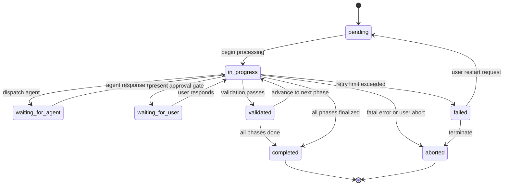
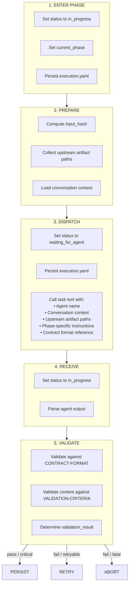
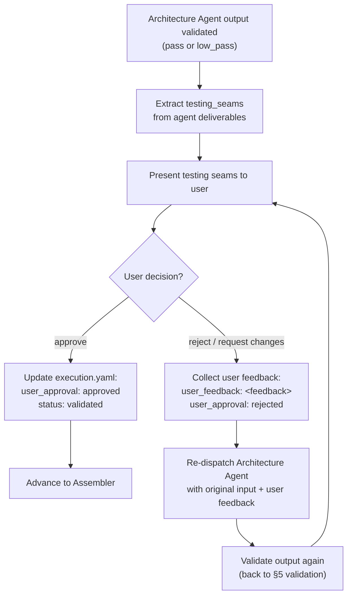

# Workflow Process

Defines the coordinator state machine, `execution.yaml` schema, input hash algorithm, resume algorithm, dispatch flow, user approval gate, backlog name generation, and error recovery procedures.

## 1. Coordinator State Machine

The coordinator maintains a state machine with these states:



### State Definitions

| State | Meaning | Entered When | Exited When |
|-------|---------|-------------|-------------|
| `pending` | Workflow created, not yet started | `execution.yaml` is first created | Coordinator begins first phase |
| `in_progress` | Coordinator is processing (computing hashes, validating, persisting) | Coordinator starts processing any phase | Coordinator dispatches agent or transitions to completed |
| `waiting_for_agent` | Agent has been dispatched via task tool, awaiting response | Coordinator calls task tool | Agent returns output or timeout |
| `waiting_for_user` | Coordinator presented a question to the user (testing seam approval or clarification) | Coordinator presents approval gate to user | User responds with approval/rejection/answer |
| `validated` | Agent output passed all contract and content validation | Validation completes successfully | Coordinator persists artifact and advances to next phase |
| `failed` | Agent returned failure, retry limit exceeded, or validation failed fatally | Fatal error encountered | Workflow aborted or user chooses to restart |
| `completed` | All phases finished, final spec delivered | Assembler output persisted and validated | N/A (terminal) |
| `aborted` | Workflow explicitly terminated | User aborts or unrecoverable error | N/A (terminal) |

### Valid State Transitions

| From | To | Condition |
|------|----|-----------|
| `pending` | `in_progress` | Coordinator begins processing |
| `in_progress` | `waiting_for_agent` | Agent dispatched via task tool |
| `waiting_for_agent` | `in_progress` | Agent output received |
| `in_progress` | `validated` | Contract + content validation pass |
| `validated` | `in_progress` | Coordinator advances to next phase or finalizes |
| `in_progress` | `completed` | All phases done, final spec persisted |
| `in_progress` | `waiting_for_user` | Testing seam question presented |
| `waiting_for_user` | `in_progress` | User responds (approve/reject with feedback) |
| `in_progress` | `failed` | Retryable error exceeded retry limit |
| `in_progress` | `aborted` | Fatal validation error or user abort |
| `failed` | `aborted` | Coordinator terminates |
| `failed` | `pending` | User requests restart from failed agent |

All transitions not listed are invalid. If the coordinator detects an impossible state transition, it treats this as a corrupted `execution.yaml` and applies error recovery.

## 2. execution.yaml Schema

Persisted at `_xzy-ai/sprints/<backlog_name>/specs/execution.yaml`:

```yaml
execution:
  backlog_name: <string>
  status: pending|in_progress|waiting_for_agent|waiting_for_user|validated|failed|completed|aborted
  current_phase: <string>  # Agent name currently executing or last executed
  created_at: <ISO8601>
  updated_at: <ISO8601>
  phases:
    discovery:
      status: pending|in_progress|completed|failed
      checkpoint:
        agent: discovery
        version: <string>  # Agent version identifier
        input_hash: <string>  # First 16 hex chars of SHA256
        output_artifact: specs/discovery-output.yaml  # Relative path
        validation_result: pass|low_pass|fail|critical_fail
        confidence: <integer>
        timestamp: <ISO8601>
    requirements:
      status: pending|in_progress|completed|failed
      checkpoint:
        agent: requirements
        version: <string>
        input_hash: <string>
        output_artifact: specs/requirements-output.yaml
        validation_result: pass|low_pass|fail|critical_fail
        confidence: <integer>
        timestamp: <ISO8601>
    architecture:
      status: pending|in_progress|completed|failed|waiting_approval
      checkpoint:
        agent: architecture
        version: <string>
        input_hash: <string>
        output_artifact: specs/architecture-output.yaml
        validation_result: pass|low_pass|fail|critical_fail
        confidence: <integer>
        timestamp: <ISO8601>
      user_approval: pending|approved|rejected
      user_feedback: <string>  # Present when rejected
    assembler:
      status: pending|in_progress|completed|failed
      checkpoint:
        agent: assembler
        version: <string>
        input_hash: <string>
        output_artifact: specs/assembler-output.yaml
        validation_result: pass|low_pass|fail|critical_fail
        confidence: <integer>
        timestamp: <ISO8601>
```

### Field Definitions

| Field | Type | Description |
|-------|------|-------------|
| `backlog_name` | string | Auto-generated kebab-case slug (see §7) |
| `status` | enum | Current state machine state |
| `current_phase` | string | Name of the agent phase currently or last executing |
| `created_at` | ISO8601 | Timestamp of initial creation |
| `updated_at` | ISO8601 | Timestamp of last state change |
| `phases.<phase>.status` | enum | Phase-level completion status |
| `phases.<phase>.checkpoint.agent` | string | Agent name (matches phase key) |
| `phases.<phase>.checkpoint.version` | string | Agent version identifier for reproducibility |
| `phases.<phase>.checkpoint.input_hash` | string | Hash of all inputs to this agent (see §3) |
| `phases.<phase>.checkpoint.output_artifact` | string | Path to the validated agent output YAML |
| `phases.<phase>.checkpoint.validation_result` | enum | Result of contract + content validation |
| `phases.<phase>.checkpoint.confidence` | integer | Agent's self-assessed confidence (0–100) |
| `phases.<phase>.checkpoint.timestamp` | ISO8601 | When checkpoint was recorded |
| `phases.architecture.user_approval` | enum | Testing seam approval status |
| `phases.architecture.user_feedback` | string | User's feedback if rejected |

### validation_result Values

| Value | Meaning | Coordinator Action |
|-------|---------|--------------------|
| `pass` | All validation rules pass | Proceed to next phase |
| `low_pass` | Warnings only (e.g., low confidence) | Proceed, log warning |
| `fail` | Retryable errors (missing fields, partial) | Retry agent with guidance |
| `critical_fail` | Fatal errors (invalid YAML, invalid status) | Abort workflow |

## 3. Input Hash Algorithm

Each phase computes an input hash before dispatching its agent. The hash enables deterministic replay detection — if inputs haven't changed, a completed artifact can be reused on resume.

### Algorithm

```
function compute_input_hash(phase_name, conversation_context, upstream_artifacts):
    inputs = []

    # Always include conversation context
    inputs.append(conversation_context)

    # Phase-specific inputs
    if phase_name == "discovery":
        # Discovery receives only conversation context
        pass

    elif phase_name == "requirements":
        # Requirements reads workspace-summary.md and reference-summary.md
        inputs.append(read_file(upstream_artifacts.workspace_summary))
        inputs.append(read_file(upstream_artifacts.reference_summary))

    elif phase_name == "architecture":
        # Architecture reads all upstream artifacts
        inputs.append(read_file(upstream_artifacts.workspace_summary))
        inputs.append(read_file(upstream_artifacts.reference_summary))
        inputs.append(read_file(upstream_artifacts.requirements))

    elif phase_name == "assembler":
        # Assembler reads all upstream artifacts
        inputs.append(read_file(upstream_artifacts.workspace_summary))
        inputs.append(read_file(upstream_artifacts.reference_summary))
        inputs.append(read_file(upstream_artifacts.requirements))
        inputs.append(read_file(upstream_artifacts.implementation_decisions))
        inputs.append(read_file(upstream_artifacts.testing_decisions))

    # Concatenate all inputs, take SHA256, return first 16 hex chars
    concatenated = "\n---INPUT-SEPARATOR---\n".join(inputs)
    full_hash = SHA256(concatenated.encode("utf-8"))
    return full_hash[0:16]
```

### Per-Phase Input Summary

| Phase | Inputs Hashed |
|-------|---------------|
| Discovery | Conversation context only |
| Requirements | Conversation context + workspace-summary.md + reference-summary.md |
| Architecture | Conversation context + workspace-summary.md + reference-summary.md + requirements.md |
| Assembler | Conversation context + all upstream artifact files |

### When Inputs Change

- If a user edits an artifact file manually, the hash will not match and the coordinator will detect this on resume.
- If conversation context changes (new messages added), hashes change and upstream phases are recomputed.
- Downstream phases whose inputs changed are always recomputed, even if their own checkpoint shows `completed`.

## 4. Resume Algorithm

When the coordinator starts (or restarts), it executes this algorithm to determine where to continue:

```
function determine_resume_point(execution_yaml, conversation_context):
    # execution_yaml is already parsed and validated as parseable
    phases = ["discovery", "requirements", "architecture", "assembler"]

    for phase in phases:
        phase_data = execution_yaml.phases[phase]

        if phase_data.status == "completed":
            # Check if inputs have changed since checkpoint
            stored_hash = phase_data.checkpoint.input_hash
            upstream_artifacts = collect_artifacts_for(phase)
            current_hash = compute_input_hash(phase, conversation_context, upstream_artifacts)

            if stored_hash == current_hash and artifact_file_exists(phase_data.checkpoint.output_artifact):
                # Artifact is still valid, skip this phase
                continue
            else:
                # Inputs changed or artifact missing — mark for recompute
                phase_data.status = "pending"
                phase_data.checkpoint = null
                return phase  # Resume from here

        if phase == "architecture" and phase_data.status == "waiting_approval":
            # Pending user approval — present gate and wait
            return { phase: "architecture", reason: "awaiting_approval" }

        if phase_data.status in ["pending", "failed"]:
            return { phase: phase, reason: "needs_execution" }

        if phase_data.status == "in_progress":
            # Likely crashed mid-dispatch — restart this phase
            return { phase: phase, reason: "interrupted" }

    # All phases completed
    return { phase: null, reason: "all_complete" }
```

### Resume Decision Matrix

| Found State | Condition | Action |
|-------------|-----------|--------|
| `completed` | Hash matches + artifact exists | Skip |
| `completed` | Hash mismatch | Mark pending, resume from here |
| `completed` | Artifact missing | Mark pending, resume from here |
| `waiting_approval` | Architecture phase | Present approval gate to user |
| `pending` | — | Execute this phase |
| `failed` | — | Retry this phase (increment retry counter) |
| `in_progress` | — | Restart this phase (assume crash) |

### Coordinator Startup Sequence

1. Check if `_xzy-ai/sprints/` exists; create if missing.
2. Parse `execution.yaml` from current backlog directory.
3. If `execution.yaml` is corrupted or missing → apply error recovery (§8).
4. Run `determine_resume_point()`.
5. If all complete → verify final `spec.md` exists and is non-empty.
6. If resume point found → begin dispatch flow from that phase.

## 5. Coordinator Dispatch Flow

For each phase, the coordinator follows this sequence:



### Step 1 — Enter Phase

```
- Update execution.yaml:
    status: in_progress
    current_phase: <phase_name>
    phases.<phase_name>.status: in_progress
- Persist execution.yaml atomically
```

### Step 2 — Prepare

```
- input_hash = compute_input_hash(phase_name, conversation_context, artifact_paths)
- upstream_paths = collect_upstream_artifact_paths(phase_name)
  - Discovery: []  (no upstream artifacts)
  - Requirements: [workspace-summary.md, reference-summary.md]
  - Architecture: [workspace-summary.md, reference-summary.md, requirements.md]
  - Assembler: [workspace-summary.md, reference-summary.md, requirements.md,
                implementation-decisions.md, testing-decisions.md]
- Verify all required upstream artifacts exist on disk before proceeding
```

### Step 3 — Dispatch

```
- Update execution.yaml:
    status: waiting_for_agent
- Persist execution.yaml
- Call task tool:
    name: generate-engineering-specs-<agent-name>
    inputs:
      conversation_context: <current conversation>
      upstream_artifacts: <map of path keys to file paths>
      contract_format_ref: CONTRACT-FORMAT.md
      validation_criteria_ref: VALIDATION-CRITERIA.md (if applicable)
      execution_yaml: <current execution.yaml>
```

### Step 4 — Receive

```
- Update execution.yaml:
    status: in_progress
- Parse agent response as YAML
```

### Step 5 — Validate

The coordinator runs two validation passes:

**Contract Validation** (structural — defined in CONTRACT-FORMAT.md):
- YAML parseable
- All required top-level keys present
- Status is valid enum value
- Confidence is integer 0–100
- All required deliverables present
- Array fields are arrays of non-empty strings

**Content Validation** (semantic — defined in VALIDATION-CRITERIA.md):
- Phase-specific quality criteria are met
- No contradictions with upstream artifacts
- Artifact files are non-empty valid markdown

**Validation Outcome:**

| Result | Action |
|--------|--------|
| `pass` | Persist artifacts, record checkpoint, advance to next phase |
| `low_pass` | Persist artifacts (with warning), record checkpoint, advance |
| `fail` | Increment retry counter; if retries < max (3), redispatch agent with validation errors included as guidance; else mark phase as `failed` |
| `critical_fail` | Abort immediately, do not retry |

### Step 6 — Persist (on pass)

```
- Write agent contract output to:
    _xzy-ai/sprints/<backlog_name>/specs/<phase-output>.yaml
- Write artifact files to their specified paths
- Update execution.yaml:
    status: validated
    phases.<phase_name>.status: completed
    phases.<phase_name>.checkpoint:
      agent: <phase_name>
      version: <current_version>
      input_hash: <computed_hash>
      output_artifact: specs/<phase-output>.yaml
      validation_result: pass|low_pass
      confidence: <from_agent_output>
      timestamp: <now>
- Persist execution.yaml
- If next phase exists → advance to next phase (goto Step 1)
- If no next phase → mark workflow as completed
```

### Step 6b — Retry (on retryable fail)

```
- Increment retry_count in execution metadata
- If retry_count >= 3:
    - Mark phase as failed
    - Update execution.yaml status: failed
    - Present failure to user with agent output and validation errors
    - Offer: retry from this phase or abort
- If retry_count < 3:
    - Re-dispatch agent with additional guidance:
        "Previous attempt failed validation:
         <validation_errors>
         Please address these issues in your new output."
```

### Step 6c — Abort (on critical fail)

```
- Update execution.yaml:
    status: aborted
    phases.<phase_name>.status: failed
- Persist execution.yaml
- Present abort reason to user with:
    - Failing agent output (if parseable)
    - Validation errors
    - Which partial artifacts were preserved
```

## 6. User Approval Gate

After the Architecture Agent completes and its output passes validation, the coordinator presents a user approval gate specifically for **testing seams**.

### Flow



### When the Gate is Triggered

- The gate triggers **automatically** after Architecture Agent validation passes.
- The gate blocks advancement to the Assembler until resolved.
- The user can only respond with one of three options:
  - **approve** — proceed to Assembler
  - **reject with feedback** — reason(s) for rejection provided, Architecture Agent re-runs
  - **request changes** — specific changes requested, Architecture Agent re-runs

### State Transitions

| Event | From | To |
|-------|------|----|
| Architecture output validated | `in_progress` | `waiting_for_user` |
| User approves | `waiting_for_user` | `validated` → `in_progress` |
| User rejects | `waiting_for_user` | `in_progress` (redispatch Architecture) |

### execution.yaml Updates

On approval: `phases.architecture.user_approval: approved`
On rejection: `phases.architecture.user_approval: rejected`, `phases.architecture.user_feedback: <feedback text>`

## 7. Backlog Name Generation

The backlog name is auto-generated when the workflow is first created. It is stored in `execution.yaml` and used as the directory name under `_xzy-ai/sprints/`.

### Algorithm

```
function generate_backlog_name(conversation_context):
    # Step 1: Extract primary topic
    # Read the first meaningful user message from conversation context
    first_message = get_first_user_message(conversation_context)
    topic = extract_topic(first_message)
    # If topic extraction fails, use "engineering-spec" as default

    # Step 2: Convert to kebab-case
    slug = topic
        .downcase()
        .strip()
        .gsub(/[^a-z0-9\s-]/, "")     # Remove special chars
        .gsub(/\s+/, "-")              # Spaces to hyphens
        .gsub(/-+/, "-")               # Collapse consecutive hyphens
        .gsub(/^-|-$/, "")             # Strip leading/trailing hyphens

    # Step 3: Truncate to 50 chars
    slug = slug[0..49]

    # Step 4: Prepend prefix
    backlog_name = "spec-" + slug

    # Step 5: Handle collisions
    dir = "_xzy-ai/sprints/" + backlog_name
    counter = 2
    while directory_exists(dir):
        suffix = "-" + counter.to_s
        truncated_slug = slug[0..(49 - suffix.length - 5)]  # Account for "spec-" prefix
        backlog_name = "spec-" + truncated_slug + suffix
        dir = "_xzy-ai/sprints/" + backlog_name
        counter += 1

    return backlog_name
```

### Examples

| Conversation Topic | Backlog Name |
|-------------------|--------------|
| "Add user authentication with JWT" | `spec-add-user-authentication-with-jwt` |
| "Implement a real-time chat feature using WebSockets" | `spec-implement-a-real-time-chat-feature-using` |
| "Refactor the payment processing module" | `spec-refactor-the-payment-processing-modul` |
| "Add user auth with JWT" (second run, collides) | `spec-add-user-auth-with-jwt-2` |

### Collision Rules

- If `_xzy-ai/sprints/<backlog_name>/` already exists, append `-2`, `-3`, etc.
- When appending a suffix, the total length (including `spec-` prefix) must not exceed 50 characters.
- If truncation is needed due to suffix, truncate the slug part before appending the suffix.
- Do not overwrite existing sprint directories.

## 8. Error Recovery

### Corrupted execution.yaml

```
if execution_yaml_file_missing or not parseable:
    artifacts_dir = "_xzy-ai/sprints/<backlog_name>/specs/"
    if directory_exists(artifacts_dir) and has_artifact_files(artifacts_dir):
        # Attempt to re-derive state from existing artifact files
        discovered_phases = []
        if file_exists(artifacts_dir + "workspace-summary.md"):
            discovered_phases.append("discovery")
        if file_exists(artifacts_dir + "requirements.md"):
            discovered_phases.append("requirements")
        if file_exists(artifacts_dir + "implementation-decisions.md"):
            discovered_phases.append("architecture")
        if file_exists(artifacts_dir + "spec.md"):
            discovered_phases.append("assembler")

        if not discovered_phases:
            # Nothing recoverable — start fresh
            create_fresh_execution_yaml()
        else:
            # Rebuild execution.yaml from discovered artifacts
            last_completed = discovered_phases.last()
            rebuild_execution_yaml(
                completed_phases: discovered_phases,
                resume_from: next_phase_after(last_completed)
            )
            notify_user: "execution.yaml was corrupted. Re-derived from existing artifacts.
                          Resume from phase: <next_phase>."
    else:
        # No artifacts exist — start fresh
        create_fresh_execution_yaml()
```

### Missing `_xzy-ai/sprints/` Root

```
if not directory_exists("_xzy-ai/sprints/"):
    create_directory("_xzy-ai/sprints/")
    # Root directory created fresh — workflow starts from pending state
```

### Agent Timeout

```
if agent_dispatch_exceeds_timeout:
    # Timeout: 120 seconds (default task tool timeout)
    mark_phase_status("failed")
    increment_retry_count()

    if retry_count < 1:
        # Retry once automatically
        redispatch_agent_with_message:
            "Previous dispatch timed out. Re-dispatching.
             Resume your work from where you left off."
    else:
        # Second timeout — abort
        update_execution_yaml(status: "aborted", phases.<phase>.status: "failed")
        notify_user:
            "Agent <phase> timed out twice. Aborting workflow.
             Partial artifacts preserved at: _xzy-ai/sprints/<backlog_name>/specs/"
```

### Invalid Agent Output (Non-Recoverable)

```
if agent_output is not parseable as YAML:
    abort_workflow()
    notify_user:
        "Agent <phase> returned unparseable output. Aborting.
         Raw output preserved at: _xzy-ai/sprints/<backlog_name>/specs/<phase>-raw-output.txt"
```

### File System Errors

| Error | Action |
|-------|--------|
| Cannot write to `_xzy-ai/sprints/` | Notify user, abort |
| Disk full | Notify user, abort |
| Permission denied | Notify user, suggest `chmod` or different directory |
| Partial write (crash during persist) | On resume, detect incomplete artifact via hash mismatch, recompute |

### Atomic Persistence

To minimize corruption risk:

1. Write new files to a temporary path first (e.g., `execution.yaml.tmp`).
2. Use `rename()` (atomic on POSIX systems) to move temp file to final path.
3. Only update `execution.yaml` after all artifact files for the phase are written.
4. If a write fails mid-phase, the previous checkpoint remains intact — the phase simply restarts on resume.
