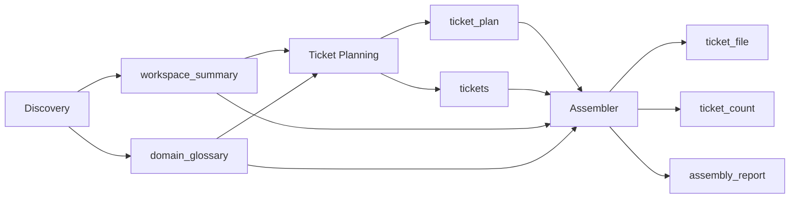

# Contract Format

Defines the standard agent output contract schema, field definitions, per-agent deliverable schemas, dependency declarations, examples, and validation rules. Every agent in the `generate-tickets` workflow must return a YAML document conforming to this contract.

## Agent Output Contract Schema

Every agent returns a single YAML document with the following top-level structure:

```yaml
status: <string>
confidence: <integer>
deliverables:
  <agent-specific-key>: <value>
missing_information:
  - <string>
assumptions:
  - <string>
questions_for_user:
  - <string>
blocking_issues:
  - <string>
recommendations:
  - <string>
```

## Field Definitions

### `status`

| Value | Meaning |
|-------|---------|
| `success` | Agent completed its work fully |
| `partial` | Agent completed partially; missing information or blockers exist |
| `failed` | Agent could not complete its work |

Must be exactly one of these three values.

### `confidence`

- **Type:** integer
- **Range:** 0–100
- **Required:** yes
- Represents the agent's self-assessed confidence in its output. 0 = completely uncertain, 100 = fully certain.
- Confidence thresholds used by the coordinator:
  - `>= 80`: PASS — immediate proceed to next phase
  - `70–79`: LOW_PASS — proceed with coordinator annotation
  - `< 70`: FAIL — retry the agent with enhanced context
  - `< 50`: CRITICAL_FAIL — escalate to user, do not retry automatically

### `deliverables`

- **Type:** object
- **Required:** yes
- **Must not be empty** when `status` is `success`.
- Keys and value types are agent-specific (see Per-Agent Deliverable Schemas below).
- Values are either:
  - **file paths** (string) — paths are **relative to `_xzy-ai/sprints/<backlog_name>/`**
  - **inline content** (string or array) — raw text embedded directly in the contract

### `missing_information`

- **Type:** array of strings
- **Required:** conditional — must be non-empty when `status` is `partial` or `failed`
- Each string describes a specific piece of information the agent could not determine.

### `assumptions`

- **Type:** array of strings
- **Required:** no (should be empty list if none)
- Each string records an assumption the agent made to proceed despite uncertainty.

### `questions_for_user`

- **Type:** array of strings
- **Required:** no (should be empty list if none)
- When non-empty, the coordinator pauses execution and presents questions to the user one at a time.

### `blocking_issues`

- **Type:** array of strings
- **Required:** conditional — must be non-empty when `status` is `failed`
- Each string describes an issue that prevents the agent from completing its work.

### `recommendations`

- **Type:** array of strings
- **Required:** no (should be empty list if none)
- Suggestions for downstream agents or the coordinator.

## Per-Agent Deliverable Schemas

### Discovery Agent

```yaml
deliverables:
  workspace_summary: <string>   # file path: tickets/workspace-summary.md
  domain_glossary:              # inline
    - <string>
```

- `workspace_summary`: path relative to `_xzy-ai/sprints/<backlog_name>/`, written as markdown. Contains: greenfield/brownfield determination, tech stack, architecture overview, existing patterns, testing patterns, relevant files, ADRs found, and codebase structure.
- `domain_glossary`: inline array of strings — key domain terms and their definitions extracted from code and documentation.

### Ticket Planning Agent

```yaml
deliverables:
  ticket_plan: <string>          # file path: tickets/ticket-plan.md
  tickets:                       # inline
    - title: <string>
      blocked_by: <array of strings>
      what_it_delivers: <string>
      acceptance_criteria:
        - <string>
```

- `ticket_plan`: path relative to `_xzy-ai/sprints/<backlog_name>/`, written as markdown. Full ticket breakdown document with context, dependencies, and ticket summaries.
- `tickets`: inline array of objects — the parsed ticket list. Each ticket has:
  - `title`: short descriptive name (will be used for filename slug)
  - `blocked_by`: array of ticket titles (empty array means "can start immediately")
  - `what_it_delivers`: the end-to-end behaviour this ticket makes work
  - `acceptance_criteria`: array of acceptance criteria strings

### Assembler Agent

```yaml
deliverables:
  ticket_file: <string>             # file path: ticket.md (at sprint root)
  ticket_count: <integer>          # number of tickets in the consolidated file
  assembly_report: <string>        # file path: tickets/assembly-report.md
  consistency_issues:              # inline
    - <string>
```

- `ticket_file`: path relative to `_xzy-ai/sprints/<backlog_name>/`, written as markdown. Contains all tickets numbered 01–NN in dependency order, each with title, what-to-build, blocked-by, status, and acceptance criteria, separated by `---`.
- `ticket_count`: integer count of tickets written into the consolidated file.
- `assembly_report`: path relative to `_xzy-ai/sprints/<backlog_name>/`, written as markdown. Report detailing the assembly process: tickets written, numbering decisions, dependency validations, deduplications.
- `consistency_issues`: inline array of strings — any dependency chain issues, missing tickets, or conflicts detected during assembly (may be empty).

## Agent Dependency Declarations

### Discovery Agent

| Direction | Artifacts |
|-----------|-----------|
| **requires** | *(nothing)* — receives only conversation context |
| **produces** | `workspace_summary`, `domain_glossary` |

### Ticket Planning Agent

| Direction | Artifacts |
|-----------|-----------|
| **requires** | `workspace_summary`, `domain_glossary` |
| **produces** | `ticket_plan`, `tickets` |

### Assembler Agent

| Direction | Artifacts |
|-----------|-----------|
| **requires** | `workspace_summary`, `domain_glossary`, `ticket_plan`, `tickets` |
| **produces** | `ticket_file`, `ticket_count`, `assembly_report`, `consistency_issues` |

### Dependency Flow



## Examples

### Well-Formed Contract: Discovery Agent

```yaml
status: success
confidence: 88
deliverables:
  workspace_summary: tickets/workspace-summary.md
  domain_glossary:
    - "User — an account holder with authentication credentials"
    - "Order — a purchase transaction containing line items and payment status"
    - "Inventory — the current stock levels of sellable products"
missing_information:
  - "No ADR documents found in the repository"
assumptions:
  - "Project uses Express.js based on package.json dependencies"
  - "PostgreSQL is the primary datastore based on connection configuration"
questions_for_user:
  - "Should existing integration tests be preserved or rewritten?"
blocking_issues: []
recommendations:
  - "The project uses a repository pattern — tickets should respect this existing architecture"
```

### Well-Formed Contract: Ticket Planning Agent

```yaml
status: success
confidence: 85
deliverables:
  ticket_plan: tickets/ticket-plan.md
  tickets:
    - title: Set up Project Scaffolding
      blocked_by: []
      what_it_delivers: "A working project structure with build tooling, linting, and CI pipeline ready for development"
      acceptance_criteria:
        - "Project builds without errors"
        - "Linting passes on all source files"
        - "CI pipeline runs successfully"
    - title: Implement User Authentication
      blocked_by:
        - "Set up Project Scaffolding"
      what_it_delivers: "Users can register, log in, and maintain an authenticated session, with JWT token refresh"
      acceptance_criteria:
        - "New users can register with email and password"
        - "Registered users can log in and receive a JWT"
        - "Protected routes reject unauthenticated requests with 401"
        - "Token refresh extends session without re-authentication"
    - title: Implement Order Creation Endpoint
      blocked_by:
        - "Implement User Authentication"
        - "Define Data Models and Database Schema"
      what_it_delivers: "Authenticated users can create orders via REST API with input validation and inventory checks"
      acceptance_criteria:
        - "POST /orders creates a new order for an authenticated user"
        - "Invalid input returns 400 with descriptive errors"
        - "Orders with out-of-stock items return 409 Conflict"
        - "Order is persisted and returns 201 with order details"
missing_information: []
assumptions:
  - "REST API is the preferred interface pattern based on existing codebase"
questions_for_user:
  - "Should tickets include frontend work or is this backend-only for now?"
blocking_issues: []
recommendations:
  - "The 'Define Data Models and Database Schema' ticket should be prioritized early as it blocks many tickets"
```

### Well-Formed Contract: Assembler Agent

```yaml
status: success
confidence: 95
deliverables:
  ticket_file: ticket.md
  ticket_count: 4
  assembly_report: tickets/assembly-report.md
  consistency_issues:
    - "Ticket 'Implement Order Creation Endpoint' references 'Define Data Models and Database Schema' as blocker but Planning Agent marked it as 'Define Data Models' — normalized to full title"
missing_information: []
assumptions:
  - "Ticket numbering follows dependency order: items with fewer blockers numbered first"
questions_for_user: []
blocking_issues: []
recommendations:
  - "Ticket 02 should be picked up immediately as it unblocks the most downstream tickets"
```

## Contract Validation Rules

The coordinator performs these checks against every agent output before accepting it.

### 1. Structure Validation

| Rule | Condition | Error |
|------|-----------|-------|
| 1.1 | Output must be parseable as YAML | `invalid_yaml` |
| 1.2 | Top-level keys must include `status`, `confidence`, `deliverables`, `missing_information`, `assumptions`, `questions_for_user`, `blocking_issues`, `recommendations` | `missing_keys` |
| 1.3 | No extra top-level keys beyond the contract schema | `extra_keys` |

### 2. Status Validation

| Rule | Condition | Error |
|------|-----------|-------|
| 2.1 | `status` must be one of `success`, `partial`, `failed` | `invalid_status` |
| 2.2 | If `status` is `partial` or `failed`, `missing_information` or `blocking_issues` must be non-empty | `incomplete_without_info` |

### 3. Confidence Validation

| Rule | Condition | Error |
|------|-----------|-------|
| 3.1 | `confidence` must be an integer | `confidence_not_integer` |
| 3.2 | `confidence` must be between 0 and 100 inclusive | `confidence_out_of_range` |
| 3.3 | If `status` is `success`, `confidence` should be >= 70 | `low_confidence_success` (warning, not error) |

### 4. Deliverables Validation

| Rule | Condition | Error |
|------|-----------|-------|
| 4.1 | `deliverables` must not be null or empty when `status` is `success` | `empty_deliverables` |
| 4.2 | All required deliverable keys for the agent must be present (see Per-Agent Deliverable Schemas) | `missing_deliverable` |
| 4.3 | File-path deliverables must be non-empty strings | `invalid_deliverable_path` |

### 5. Array Validation

| Rule | Condition | Error |
|------|-----------|-------|
| 5.1 | `missing_information`, `assumptions`, `questions_for_user`, `blocking_issues`, `recommendations` must all be arrays | `field_not_array` |
| 5.2 | Each element in these arrays must be a non-empty string | `empty_array_element` |

### 6. Validation Outcome

| Result | Coordinator Action |
|--------|-------------------|
| All rules pass | Accept output, persist contract to metadata YAML, proceed to next agent |
| Warnings only (e.g., low confidence on success) | Accept output, log warning, proceed |
| Errors with retryable rules | Reject output, retry agent with specific guidance |
| Errors with fatal rules | Reject output, abort workflow, preserve partial artifacts |
