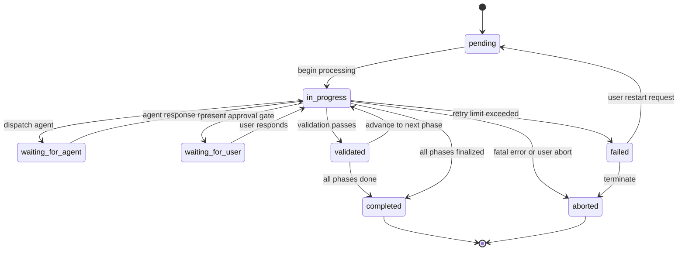
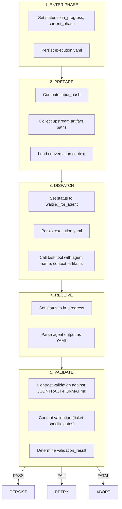
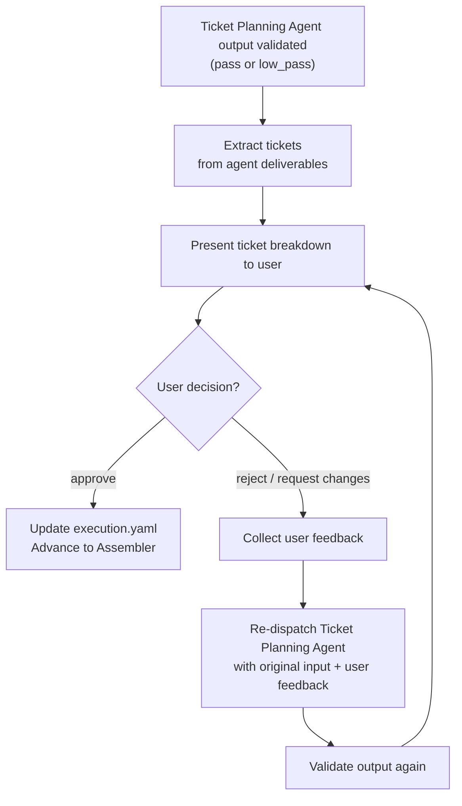

# Workflow Process

Defines the coordinator state machine, `execution.yaml` schema, input hash algorithm, resume algorithm, dispatch flow, user approval gate, backlog name generation, and error recovery procedures for `generate-tickets`.

## 1. Coordinator State Machine

The coordinator maintains a state machine with these states:



### State Definitions

| State | Meaning | Entered When | Exited When |
|-------|---------|-------------|-------------|
| `pending` | Workflow created, not yet started | `execution.yaml` is first created | Coordinator begins first phase |
| `in_progress` | Coordinator is processing (computing hashes, validating, persisting) | Coordinator starts processing any phase | Coordinator dispatches agent or transitions to completed |
| `waiting_for_agent` | Agent has been dispatched via task tool, awaiting response | Coordinator calls task tool | Agent returns output or timeout |
| `waiting_for_user` | Coordinator presented the ticket breakdown to the user for approval | Coordinator presents approval gate | User responds with approval/rejection/feedback |
| `validated` | Agent output passed all contract and content validation | Validation completes successfully | Coordinator persists artifact and advances to next phase |
| `failed` | Agent returned failure, retry limit exceeded, or validation failed fatally | Fatal error encountered | Workflow aborted or user chooses to restart |
| `completed` | All phases finished, ticket.md written | Assembler output persisted and validated | N/A (terminal) |
| `aborted` | Workflow explicitly terminated | User aborts or unrecoverable error | N/A (terminal) |

### Valid State Transitions

| From | To | Condition |
|------|----|-----------|
| `pending` | `in_progress` | Coordinator begins processing |
| `in_progress` | `waiting_for_agent` | Agent dispatched via task tool |
| `waiting_for_agent` | `in_progress` | Agent output received |
| `in_progress` | `validated` | Contract + content validation pass |
| `validated` | `in_progress` | Coordinator advances to next phase or finalizes |
| `in_progress` | `completed` | All phases done, tickets persisted |
| `in_progress` | `waiting_for_user` | Ticket breakdown approval presented |
| `waiting_for_user` | `in_progress` | User responds (approve/reject with feedback) |
| `in_progress` | `failed` | Retryable error exceeded retry limit |
| `in_progress` | `aborted` | Fatal validation error or user abort |
| `failed` | `aborted` | Coordinator terminates |
| `failed` | `pending` | User requests restart from failed agent |

All transitions not listed are invalid. If the coordinator detects an impossible state transition, it treats this as a corrupted `execution.yaml` and applies error recovery.

## 2. execution.yaml Schema

Persisted at `_xzy-ai/sprints/<backlog_name>/tickets/execution.yaml`:

```yaml
execution:
  backlog_name: <string>
  status: pending|in_progress|waiting_for_agent|waiting_for_user|validated|failed|completed|aborted
  current_phase: <string>
  created_at: <ISO8601>
  updated_at: <ISO8601>
  phases:
    discovery:
      status: pending|in_progress|completed|failed
      checkpoint:
        agent: discovery
        version: <string>
        input_hash: <string>
        output_artifact: tickets/discovery-output.yaml
        validation_result: pass|low_pass|fail|critical_fail
        confidence: <integer>
        timestamp: <ISO8601>
    ticket_planning:
      status: pending|in_progress|completed|failed|waiting_approval
      checkpoint:
        agent: ticket-planning
        version: <string>
        input_hash: <string>
        output_artifact: tickets/planning-output.yaml
        validation_result: pass|low_pass|fail|critical_fail
        confidence: <integer>
        timestamp: <ISO8601>
      user_approval: pending|approved|rejected
      user_feedback: <string>
    assembler:
      status: pending|in_progress|completed|failed
      checkpoint:
        agent: assembler
        version: <string>
        input_hash: <string>
        output_artifact: tickets/assembler-output.yaml
        validation_result: pass|low_pass|fail|critical_fail
        confidence: <integer>
        timestamp: <ISO8601>
```

### Field Definitions

| Field | Type | Description |
|-------|------|-------------|
| `backlog_name` | string | Auto-generated kebab-case slug (see §7) |
| `status` | enum | Current state machine state |
| `current_phase` | string | Name of the agent phase currently or last executing |
| `created_at` | ISO8601 | Timestamp of initial creation |
| `updated_at` | ISO8601 | Timestamp of last state change |
| `phases.<phase>.status` | enum | Phase-level completion status |
| `phases.<phase>.checkpoint.agent` | string | Agent name (matches phase key) |
| `phases.<phase>.checkpoint.version` | string | Agent version identifier |
| `phases.<phase>.checkpoint.input_hash` | string | Hash of all inputs to this agent (see §3) |
| `phases.<phase>.checkpoint.output_artifact` | string | Path to the validated agent output YAML |
| `phases.<phase>.checkpoint.validation_result` | enum | Result of contract + content validation |
| `phases.<phase>.checkpoint.confidence` | integer | Agent's self-assessed confidence (0–100) |
| `phases.<phase>.checkpoint.timestamp` | ISO8601 | When checkpoint was recorded |
| `phases.ticket_planning.user_approval` | enum | Ticket breakdown approval status |
| `phases.ticket_planning.user_feedback` | string | User's feedback if rejected |

### validation_result Values

| Value | Meaning | Coordinator Action |
|-------|---------|--------------------|
| `pass` | All validation rules pass | Proceed to next phase |
| `low_pass` | Warnings only (e.g., low confidence) | Proceed, log warning |
| `fail` | Retryable errors (missing fields, partial) | Retry agent with guidance |
| `critical_fail` | Fatal errors (invalid YAML, invalid status) | Abort workflow |

## 3. Input Hash Algorithm

Each phase computes an input hash before dispatching its agent. The hash enables deterministic replay detection — if inputs haven't changed, a completed artifact can be reused on resume.

### Algorithm

```
function compute_input_hash(phase_name, conversation_context, upstream_artifacts):
    inputs = []
    inputs.append(conversation_context)

    if phase_name == "discovery":
        pass  # Discovery receives only conversation context

    elif phase_name == "ticket_planning":
        inputs.append(read_file(upstream_artifacts.workspace_summary))

    elif phase_name == "assembler":
        inputs.append(read_file(upstream_artifacts.workspace_summary))
        inputs.append(read_file(upstream_artifacts.ticket_plan))

    concatenated = "\n---INPUT-SEPARATOR---\n".join(inputs)
    full_hash = SHA256(concatenated.encode("utf-8"))
    return full_hash[0:16]
```

### Per-Phase Input Summary

| Phase | Inputs Hashed |
|-------|---------------|
| Discovery | Conversation context only |
| Ticket Planning | Conversation context + workspace-summary.md |
| Assembler | Conversation context + workspace-summary.md + ticket-plan.md |

### When Inputs Change

- If a user edits an artifact file manually, the hash will not match and the coordinator will detect this on resume.
- If conversation context changes (new messages added), hashes change and upstream phases are recomputed.
- Downstream phases whose inputs changed are always recomputed, even if their own checkpoint shows `completed`.

## 4. Resume Algorithm

When the coordinator starts (or restarts), it executes this algorithm to determine where to continue:

```
function determine_resume_point(execution_yaml, conversation_context):
    phases = ["discovery", "ticket_planning", "assembler"]

    for phase in phases:
        phase_data = execution_yaml.phases[phase]

        if phase_data.status == "completed":
            stored_hash = phase_data.checkpoint.input_hash
            upstream_artifacts = collect_artifacts_for(phase)
            current_hash = compute_input_hash(phase, conversation_context, upstream_artifacts)

            if stored_hash == current_hash and artifact_file_exists(phase_data.checkpoint.output_artifact):
                continue  # Artifact still valid, skip
            else:
                phase_data.status = "pending"
                phase_data.checkpoint = null
                return { phase: phase, reason: "inputs_changed" }

        if phase == "ticket_planning" and phase_data.status == "waiting_approval":
            return { phase: "ticket_planning", reason: "awaiting_approval" }

        if phase_data.status in ["pending", "failed"]:
            return { phase: phase, reason: "needs_execution" }

        if phase_data.status == "in_progress":
            return { phase: phase, reason: "interrupted" }

    return { phase: null, reason: "all_complete" }
```

### Resume Decision Matrix

| Found State | Condition | Action |
|-------------|-----------|--------|
| `completed` | Hash matches + artifact exists | Skip |
| `completed` | Hash mismatch | Mark pending, resume from here |
| `completed` | Artifact missing | Mark pending, resume from here |
| `waiting_approval` | Ticket Planning phase | Present approval gate to user |
| `pending` | — | Execute this phase |
| `failed` | — | Retry this phase (increment retry counter) |
| `in_progress` | — | Restart this phase (assume crash) |

## 5. Coordinator Dispatch Flow

For each phase, the coordinator follows this sequence:



### Step 1 — Enter Phase

- Update `execution.yaml`: set `status: in_progress`, `current_phase: <phase_name>`, `phases.<phase_name>.status: in_progress`
- Persist atomically (write to `.tmp` then rename)

### Step 2 — Prepare

- `input_hash = compute_input_hash(phase_name, conversation_context, artifact_paths)`
- Verify all required upstream artifacts exist on disk before proceeding

### Step 3 — Dispatch

- Update `execution.yaml`: set `status: waiting_for_agent`
- Persist
- Call task tool with agent-specific inputs

### Step 4 — Receive

- Update `execution.yaml`: set `status: in_progress`
- Parse agent response as YAML

### Step 5 — Validate

Two validation passes:

**Contract Validation** (./CONTRACT-FORMAT.md):
- YAML parseable
- All required top-level keys present
- Status is valid enum value
- Confidence is integer 0–100
- All required deliverables present
- Array fields are arrays of non-empty strings

**Content Validation** (phase-specific gates):
- Discovery: greenfield/brownfield explicit, domain glossary present, workspace summary substantive
- Ticket Planning: tickets non-empty array, each has title/blocked_by/what_it_delivers/acceptance_criteria, blocking edges reference existing tickets, vertical slice rule applied
- Assembler: `ticket.md` exists at sprint root and is non-empty, numbering follows dependency order, every blocker references an existing ticket, no orphan tickets, no circular dependencies

## 6. User Approval Gate

After the Ticket Planning Agent completes and its output passes validation, the coordinator presents a user approval gate for the **ticket breakdown**.

### Flow



### When the Gate is Triggered

- The gate triggers **automatically** after Ticket Planning Agent validation passes.
- The gate blocks advancement to the Assembler until resolved.
- The user can only respond with one of three options:
  - **approve** — proceed to Assembler
  - **reject with feedback** — reason(s) for rejection, Ticket Planning re-runs
  - **request changes** — specific changes requested, Ticket Planning re-runs

### State Transitions

| Event | From | To |
|-------|------|----|
| Planning output validated | `in_progress` | `waiting_for_user` |
| User approves | `waiting_for_user` | `validated` → `in_progress` |
| User rejects | `waiting_for_user` | `in_progress` (redispatch Planning) |

### execution.yaml Updates

On approval: `phases.ticket_planning.user_approval: approved`
On rejection: `phases.ticket_planning.user_approval: rejected`, `phases.ticket_planning.user_feedback: <feedback text>`

## 7. Backlog Name Generation

The backlog name is auto-generated when the workflow is first created.

### Algorithm

```
function generate_backlog_name(conversation_context):
    first_message = get_first_user_message(conversation_context)
    topic = extract_topic(first_message)  # fallback: "tickets"

    slug = topic
        .downcase()
        .strip()
        .gsub(/[^a-z0-9\s-]/, "")
        .gsub(/\s+/, "-")
        .gsub(/-+/, "-")
        .gsub(/^-|-$/, "")

    slug = slug[0..43]  # Reserve space for "tix-" prefix + optional "-N" suffix

    backlog_name = "tix-" + slug

    # Handle collisions
    counter = 2
    while directory_exists("_xzy-ai/sprints/" + backlog_name):
        suffix = "-" + counter.to_s
        truncated = slug[0..(43 - suffix.length)]
        backlog_name = "tix-" + truncated + suffix
        counter += 1

    return backlog_name
```

### Examples

| Conversation Topic | Backlog Name |
|-------------------|--------------|
| "Add user authentication with JWT" | `tix-add-user-authentication-with-jwt` |
| "Implement real-time chat using WebSockets" | `tix-implement-real-time-chat-using-webs` |
| "Add user auth" (second run, collides) | `tix-add-user-auth-2` |

## 8. Error Recovery

### Corrupted execution.yaml

If `execution.yaml` is missing or unparseable:
1. Check if `_xzy-ai/sprints/<backlog_name>/tickets/` has artifact files and if `_xzy-ai/sprints/<backlog_name>/ticket.md` exists.
2. If artifacts or ticket.md exist, re-derive state: check which files exist to determine which phases completed.
3. If no artifacts exist, start fresh.
4. Rebuild `execution.yaml` from discovered state, resume from next pending phase.

### Missing `_xzy-ai/sprints/` Root

Create `_xzy-ai/sprints/`. Workflow starts from pending state.

### Agent Timeout

- Timeout: 120 seconds (default task tool timeout)
- Retry once automatically with message: "Previous dispatch timed out. Resume your work."
- Second timeout: abort, preserve partial artifacts.

### Invalid Agent Output (Non-Recoverable)

- Abort workflow.
- Preserve raw output at `<phase>-raw-output.txt`.
- Notify user.

### File System Errors

| Error | Action |
|-------|--------|
| Cannot write to `_xzy-ai/sprints/` | Notify user, abort |
| Disk full | Notify user, abort |
| Permission denied | Notify user, suggest resolution |
| Partial write (crash) | On resume, detect via hash mismatch, recompute |

### Atomic Persistence

1. Write new files to `.tmp` path first.
2. Use `rename()` (atomic on POSIX) to move temp file to final path.
3. Only update `execution.yaml` after all artifact files for the phase are written.
4. If a write fails mid-phase, the previous checkpoint remains intact.
