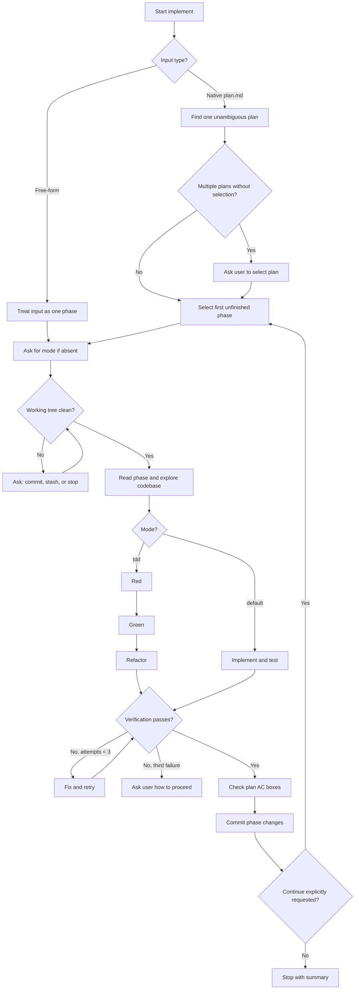

# Implement Workflow

## Phase Cycle

1. Identify the input and phase.
2. Resolve mode. Ask for `default` or `tdd` whenever no explicit mode is supplied.
3. Inspect `git status`. Existing changes must be handled by asking the user to commit, stash, or stop. Begin only with a clean tree; pre-existing `_xzy-ai/` planning changes are excluded.
4. Read the selected phase, architecture guidance, repository instructions, source patterns, and relevant tests.
5. Implement directly in the current checkout.
6. For functional phases, add or update tests. For scaffolding, run applicable syntax/build/config checks.
7. Run normal project verification. If no command is identifiable, try build, lint, typecheck, then a user-defined command. Ask if none applies.
8. Retry failing verification up to three self-fix attempts. Stop and ask after the third failure.
9. In TDD mode, preserve Red → Green → Refactor commits directly on the current branch. Use the scaffolding fallback when no failing test seam exists.
10. Check the completed phase's acceptance criteria in the source `plan.md`.
11. Commit only the phase changes and plan checkbox updates, using the selected commit convention.
12. Stop after one phase unless the original request explicitly asks to continue.

## Input Selection

### Native plan

Use `_xzy-ai/sprints/<backlog>/plans/features/<NNN>/plan.md` when the user provides it or when exactly one candidate plan is available. If several candidate plans exist and the user did not identify one, ask before reading a phase. Skip phases whose acceptance criteria are all checked. If every phase is complete, report completion without creating a commit.

### Free-form

Treat free-form input as one phase. Do not create a normalized plan, progress log, assignment, or report. Use feature number `001` in commits when no feature number is available.

## Continuation

The default is one phase per invocation. If the original request explicitly asks to continue, return to phase selection after the approved phase commit and process the next unfinished phase sequentially.
