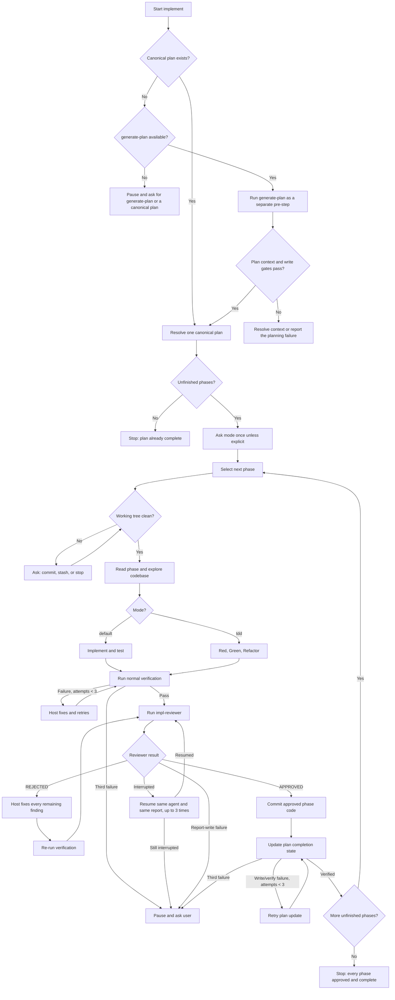

# Implement Workflow



## Plan-first workflow

1. Resolve the workspace and project root.
2. If a canonical `plan.md` exists, use it.
3. If no canonical plan exists, use the available `generate-plan` skill as a separate pre-step. If it is unavailable, pause and ask the user to make it available or provide a canonical plan.
4. Resolve missing backlog, feature identity/title, outcome, actors, scope, dependencies, or Acceptance Criteria through the existing context/discussion gate. Do not guess.
5. Continue only after the plan has been written and verified. Do not ask for a second confirmation solely because the plan was generated automatically.

## Phase Cycle

For each unfinished phase, work on only that phase until it is approved and complete:

1. Resolve the phase from the canonical plan and record the baseline SHA before changing code.
2. Ask for `default` or `tdd` once at the start of the plan run when no mode was explicitly supplied. Apply it to every phase unless the user explicitly overrides the mode for a particular phase.
3. Inspect `git status`. Existing changes must be handled by asking the user to commit, stash, or stop. Begin a phase only with a clean project-root tree; pre-existing workspace `_xzy-ai/` artifacts are excluded.
4. Read the phase's user stories, What to build content, and Acceptance Criteria, plus architecture guidance, repository instructions, source patterns, and relevant tests.
5. Implement directly in the project-root checkout.
6. For functional phases, add or update tests. For scaffolding, run applicable syntax/build/config checks.
7. Run normal project verification. If no command is identifiable, try build, lint, typecheck, then a user-defined command. Ask if none applies.
8. Retry a failing normal verification up to three self-fix attempts. Do not commit failing work.
9. Run `impl-reviewer` before committing the phase. Pass the baseline SHA, absolute project root, canonical plan path, backlog, feature, phase, mode, previous progress text or `None`, and current progress/status text. Do not pass a direct phase contract or report path.
10. If the reviewer returns `REJECTED`, fix every finding that remains, rerun normal verification, and resume the same reviewer agent ID for a new review attempt. The reviewer writes the next numbered report; repeat until it explicitly returns `verdict: APPROVED`.
11. If the reviewer is interrupted, resume the same agent ID and same report up to three times. If it still stops, pause and ask the user. If report persistence fails after the reviewer's three write/read-back retries, pause and ask the user; never use an inline-only approval.
12. After `APPROVED`, commit the phase code/TDD changes, including reviewer direct fixes. Reviewer reports remain workspace-local and are not committed.
13. Update the canonical plan's phase completion state separately and verify the write. Retry the plan update up to three times; if it remains unsuccessful, preserve the code commit, do not advance, and ask the user.
14. Begin the next unfinished phase only after the commit and plan completion update both succeed.

## Reviewer report lifecycle

The reviewer derives its report path automatically:

```text
_xzy-ai/sprints/<backlog>/implement/<feature>/reviews/impl-reviewer/phase-<phase>/report-<NN>.md
```

The report starts as `Status: IN_PROGRESS` and `Verdict: PENDING`. It stores all handoff metadata and the full review. Evidence, checks, findings, and direct fixes are appended as they are discovered, so a context, network, or execution interruption leaves useful partial evidence. A completed report transitions to `Status: COMPLETE` with `Verdict: APPROVED` or `REJECTED` and is read back before the reviewer returns:

```text
report_path: <absolute report path>
verdict: APPROVED | REJECTED
```

A resumed interruption continues the same report. A new post-fix review attempt uses the next zero-padded report number. Invalid inputs are rejected before report creation; report-write failures are not converted into acceptance findings or inline approval.

## Input Selection

### Canonical plan

Use `_xzy-ai/sprints/<backlog>/plans/features/<NNN>/plan.md` when the user provides it or when exactly one candidate plan is available. If several candidate plans exist and the user did not identify one, ask before reading a phase. Skip phases whose Acceptance Criteria are all checked. If every phase is complete, report completion without creating a commit.

### No-plan request

A request without a plan is not treated as a direct phase. Invoke the available `generate-plan` skill first, then use the resulting canonical plan and its phase Acceptance Criteria. Do not create an ephemeral normalized contract or a direct free-form implementation phase.

## Recovery

- Normal verification failures: up to three host self-fix attempts.
- Reviewer interruption: resume the same agent ID and same report up to three times, then pause for the user.
- Reviewer report writes/read-backs: up to three immediate attempts without sleeping, then pause for the user.
- Plan completion update: up to three write/read-back attempts after the code commit, then pause for the user.

## Completion

Continue the phase cycle until every phase in the canonical plan is approved, committed, and marked complete. Then stop with a concise completion summary.
