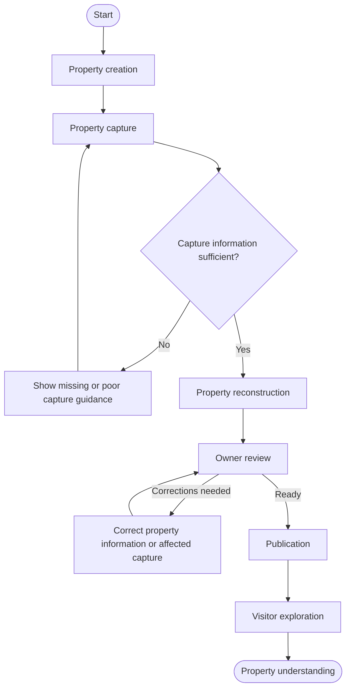
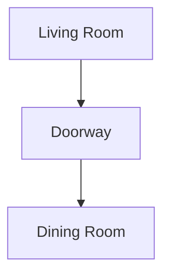
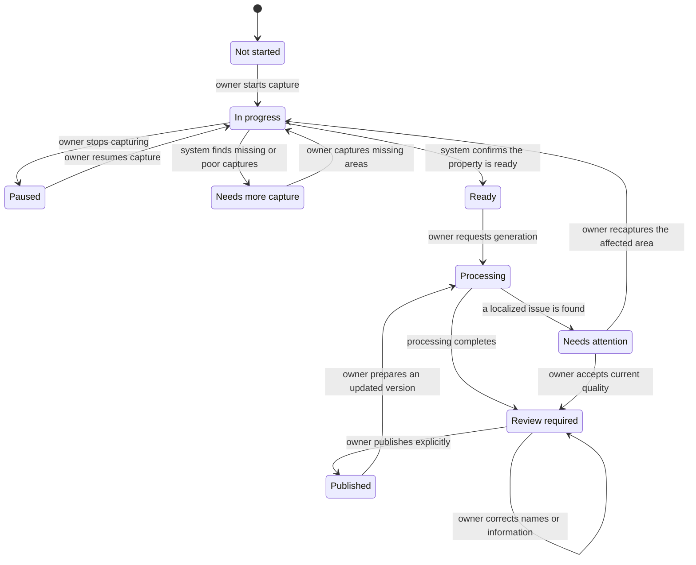
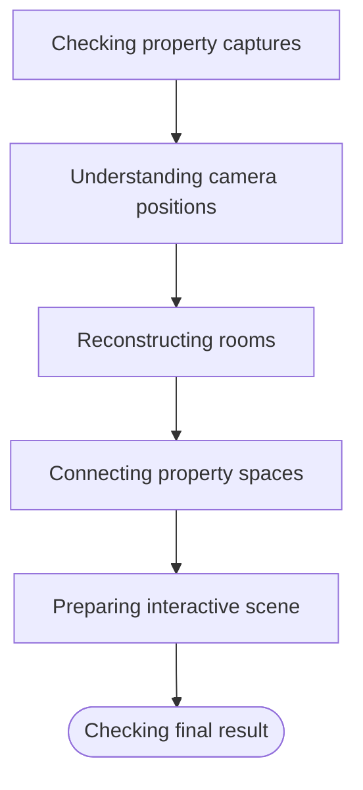
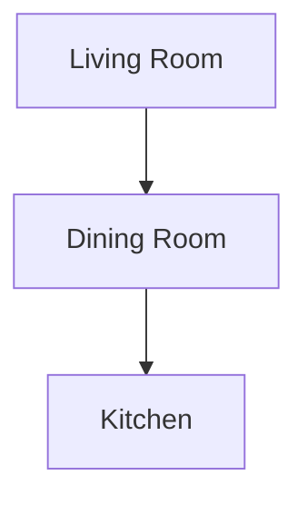
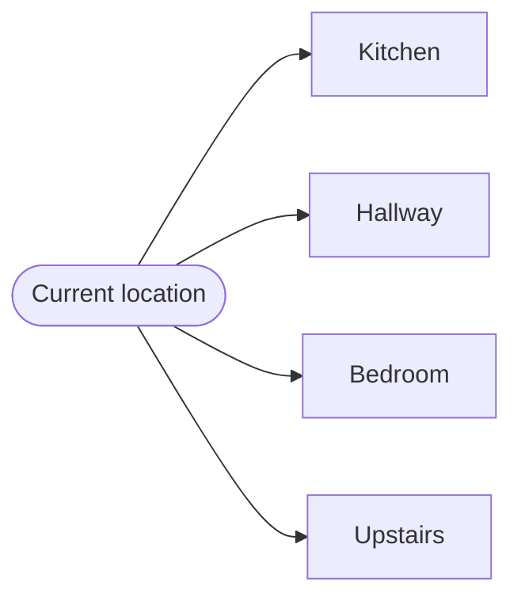
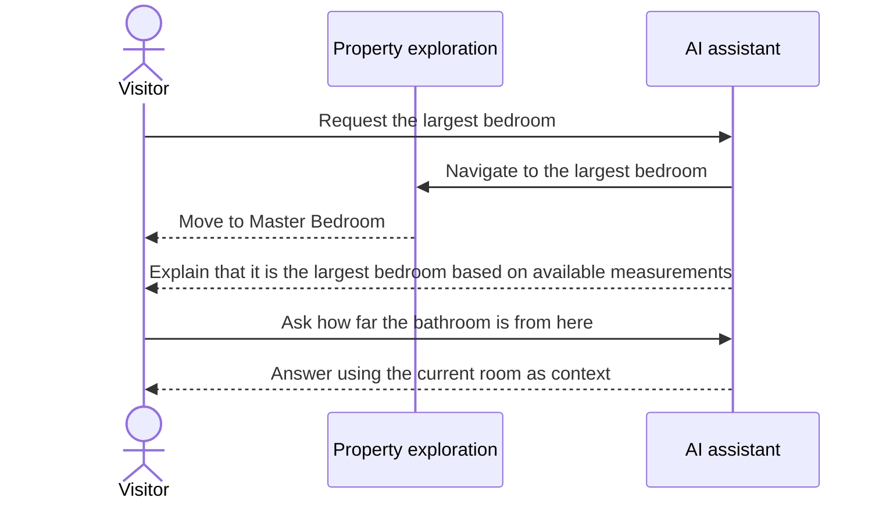
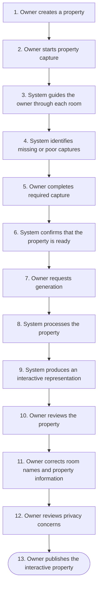
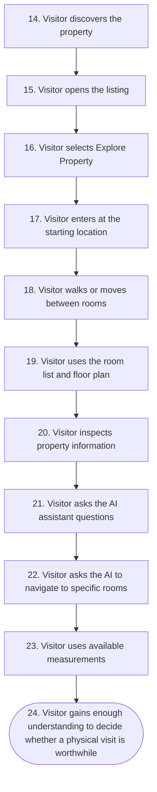
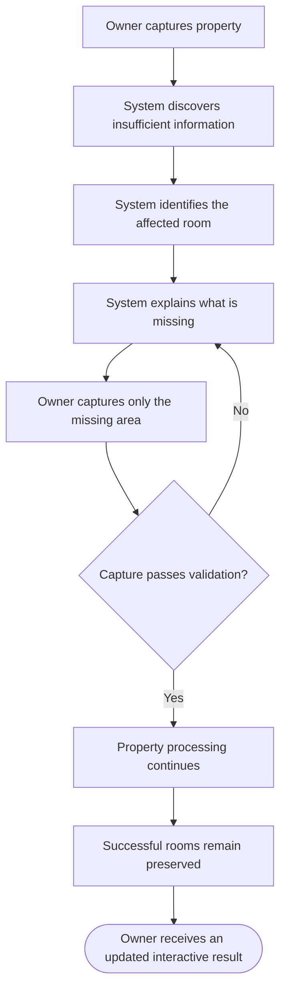

# Interactive Property Exploration

## 1. Product Intent

Build a property application that allows property owners or agents to capture a property from multiple viewpoints and transform those captures into an interactive property experience that can be explored remotely by prospective buyers or tenants.

The application should allow visitors to understand a property without physically visiting it first.

The experience should provide more spatial understanding than conventional property photos or videos.

The system should behave as a complete journey from:

### Diagram J1 — Primary journey: from property creation to visitor understanding



The proposal defines expected behavior only.

Implementation architecture, libraries, storage decisions, rendering technologies, reconstruction technologies, infrastructure, and internal technical design are intentionally left to the implementation agents.

---

# 2. Primary Actors

The system has three primary actors.

## Property Owner / Agent

Responsible for:

```text
creating the property

capturing the property

providing property information

reviewing the generated result

correcting property information

publishing the interactive property experience
```

## Property Visitor

Responsible for:

```text
discovering a property

viewing its information

exploring the property remotely

moving between rooms

understanding spatial relationships

reviewing property details

asking questions

deciding whether the property is worth visiting physically
```

## System

Responsible for:

```text
guiding capture

validating captured information

processing the property

generating an explorable representation

detecting incomplete or problematic captures

organizing rooms and spaces

presenting the property interactively

supporting visitor exploration

communicating uncertainty where appropriate
```

---

# 3. Property Creation Behavior

A property owner should be able to create a property before capturing it.

The system should allow the owner to provide available information such as:

```text
property name

property type

address or location

price

description

land size

building size

number of floors

number of bedrooms

number of bathrooms

parking information

property facilities
```

Not every property field must be required immediately.

The owner should be allowed to progressively complete the property information.

After creating the property, the system should make the property available for further capture and preparation without making it publicly visible automatically.

---

# 4. Property Capture Entry Behavior

From a property, the owner should be able to start a new capture.

The system should clearly explain that the goal is to capture enough viewpoints to reconstruct and understand the property spatially.

The system should not expect the owner to understand technical concepts related to computer vision or 3D reconstruction.

Instead, it should provide simple instructions such as:

```text
Start from the entrance.

Move slowly around the room.

Keep previously captured areas visible in the next image.

Capture every corner.

Capture the doorway before leaving the room.

Do not move objects while capturing.
```

The capture experience should behave like an assistant rather than a simple file uploader.

---

# 5. Room Capture Behavior

The owner should be able to capture the property room by room or area by area.

A property may contain spaces such as:

```text
exterior

entrance

living room

family room

kitchen

dining room

bedroom

bathroom

hallway

stairs

balcony

garage

garden

storage

other spaces
```

The owner should be able to identify the current space manually if the system cannot determine it confidently.

The system should allow the owner to rename rooms at any time before publication.

---

# 6. Guided Capture Behavior

While the user is capturing a room, the system should continuously communicate capture completeness.

Example:

```text
Living Room

Coverage: 68%

Captured:

✓ main wall
✓ sofa area
✓ window
✓ left corner

Still needed:

! doorway
! right corner
! area behind sofa
```

The system should provide direct actionable guidance.

Examples:

```text
Move slightly to the right.

Capture the doorway from this position.

Move closer to the rear corner.

Take another photo while keeping the sofa visible.

Capture the area behind you.

Capture the connection to the hallway.
```

The user should never be expected to determine reconstruction requirements manually.

---

# 7. Capture Quality Behavior

When an image is unusable or likely to reduce reconstruction quality, the system should notify the user as early as possible.

Examples:

```text
This image is too blurry.

The room is too dark in this image.

This image is almost identical to the previous image.

The camera moved too far from the previous position.

There is not enough visual overlap.

This area has already been captured sufficiently.
```

Whenever possible, the system should provide a corrective instruction.

Example:

```text
Image rejected.

Reason:
The image is too blurry.

Action:
Hold the camera steady and capture the same area again.
```

---

# 8. Capture Continuity Behavior

The system should understand that rooms are connected to other rooms.

When capturing a doorway, hallway, staircase, or other transition, the system should preserve that connection.

For example:

### Diagram P1 — Example room connection



The system should encourage users to capture transitions between spaces so visitors can later understand how spaces connect.

If a room appears visually complete but its connection to neighboring rooms is unclear, the system should warn the owner.

Example:

```text
Living Room capture is visually complete.

However, the connection between Living Room and Kitchen is unclear.

Capture the doorway from both sides before continuing.
```

---

# 9. Completing a Room

The system should indicate when a room has enough capture information.

Example:

```text
Living Room

Capture complete.

Coverage: Good
Image quality: Good
Room connections: Complete

You may continue to another room.
```

The owner should still be allowed to capture additional views.

The system should distinguish between:

```text
minimum sufficient capture

and

recommended high-quality capture
```

The owner should understand whether continuing to take more images is useful.

---

# 10. Property Capture Progress

The owner should always be able to understand overall property capture progress.

Example:

```text
Property Capture

Ground Floor

✓ Entrance
✓ Living Room
✓ Kitchen
○ Dining Room
! Bathroom

Second Floor

○ Master Bedroom
○ Bedroom 2
○ Bathroom
```

Possible states may include concepts such as:

### Diagram S1 — User-visible property lifecycle states



The system should present these as understandable user-facing states rather than technical processing states.

---

# 11. Capture Interruption and Resume

The owner should be able to stop capturing and resume later.

Previously completed captures should remain available.

The system should remember:

```text
rooms already captured

areas still missing

previous capture guidance

room relationships already discovered
```

The owner should not need to restart the entire property because one capture session was interrupted.

---

# 12. Uploading Existing Photos

The owner should also be able to upload existing property photos.

The system should inspect them and determine whether they are useful for the interactive reconstruction.

The system should not imply that normal property photography is automatically sufficient.

Possible result:

```text
27 images uploaded.

18 images can be used.

9 images have insufficient overlap.

Additional capture is recommended for:

- kitchen
- hallway
- master bedroom
```

Existing photos should supplement guided capture whenever useful.

---

# 13. Capture Readiness Review

Before the property is processed into an interactive experience, the system should present a capture readiness summary.

Example:

```text
Property Capture Review

Living Room
Ready

Kitchen
Ready

Master Bedroom
Needs more coverage

Bathroom
Ready

Hallway
Missing connection to staircase
```

The owner should be able to:

```text
continue capturing

accept current quality

remove problematic images

replace images

review specific rooms
```

---

# 14. Processing Start Behavior

Once enough information is available, the owner should be able to request generation of the interactive property experience.

The system should clearly indicate that the property is being processed.

Example:

```text
Preparing interactive property.

Your original captures are preserved.

You may leave this page and return later.
```

The owner should not need to keep the application open.

---

# 15. Processing Progress Behavior

The system should provide meaningful progress rather than exposing only an indefinite loading state.

The user-facing progress may communicate concepts such as:

### Diagram P3 — Processing progress stages



Exact internal processing terminology does not need to be exposed.

---

# 16. Processing Failure Behavior

If processing fails, the system should explain what happened in terms the owner can act upon.

Bad behavior:

```text
Processing failed.
```

Preferred behavior:

```text
The Kitchen could not be reconstructed reliably.

Most images were captured from almost the same position.

Capture several additional views while moving around the Kitchen.
```

Failures affecting one room should not automatically require recapturing the entire property.

---

# 17. Partial Reconstruction Behavior

If most of the property can be reconstructed but one area cannot, the system should preserve successful areas whenever possible.

Example:

```text
Property reconstruction completed with issues.

Ready:

✓ Living Room
✓ Kitchen
✓ Bedroom
✓ Bathroom

Needs attention:

! Balcony
```

The owner should be able to repair or recapture only the affected area.

---

# 18. Generated Property Review

Before publication, the owner should be able to explore the generated property exactly as visitors will.

The owner should be encouraged to verify:

```text
room appearance

room names

room connections

navigation paths

floor assignments

property entry point

visual artifacts

privacy issues

property metadata
```

The system should not automatically publish the generated property.

---

# 19. Room Verification Behavior

The system may automatically identify spaces, but the owner should remain the final authority over room identity.

For example, the system may suggest:

```text
Detected:
Bedroom
```

The owner should be able to change it to:

```text
Guest Bedroom
```

or:

```text
Study Room
```

AI-generated labels should remain editable.

---

# 20. Floor Verification Behavior

For multi-floor properties, the system should organize rooms by floor.

Example:

```text
Ground Floor

Entrance
Living Room
Kitchen
Bathroom

Second Floor

Master Bedroom
Bedroom 2
Bathroom
Balcony
```

The owner should be able to correct rooms assigned to the wrong floor.

---

# 21. Property Connection Verification

The owner should be able to inspect how spaces are connected.

Example:

### Diagram P2 — Example multi-room connection



If a generated connection is incorrect, the owner should be able to remove or correct it.

If an expected connection is missing, the owner should be able to indicate it and provide additional capture if needed.

---

# 22. Privacy Review

Before publication, the system should encourage the owner to check for private or sensitive information visible in the property.

Examples include:

```text
faces

family photographs

vehicle license plates

documents

computer screens

personal identifiers

private belongings
```

When the system can identify potentially sensitive content, it should flag it for review.

The owner should be able to decide whether the affected content should be hidden, replaced, removed, or left unchanged.

---

# 23. Publishing Behavior

Once the owner is satisfied with the result, the interactive property experience should be publishable as part of the property listing.

The owner should explicitly choose to publish it.

The generated scene should never become public only because processing finished.

The owner should be able to unpublish it later without deleting the underlying property data.

---

# 24. Property Listing Visitor Behavior

When a visitor opens a property listing, conventional property information should still be available.

The interactive property experience should complement rather than replace basic listing information.

A visitor may see:

```text
photos

property description

price

location

facilities

room information

property dimensions

interactive property exploration
```

The interactive experience should be clearly discoverable.

Example action:

```text
Explore Property
```

---

# 25. Entering Property Exploration

When a visitor starts exploring, the system should place them at a meaningful starting location.

Typically:

```text
property entrance
```

or another owner-approved starting point.

The visitor should immediately understand:

```text
where they are

which room they are currently viewing

how to move

how to access other rooms
```

The experience should not require a tutorial before basic exploration is possible.

---

# 26. Free Exploration Behavior

Visitors should be able to look around the current environment naturally.

Depending on available scene information, visitors should be able to move around the property.

The system should prevent navigation into obviously invalid areas such as:

```text
through walls

outside reconstructed boundaries

inside furniture

into missing scene areas
```

When free movement is not reliable in a particular area, the system may use guided navigation rather than presenting broken movement.

---

# 27. Navigation Point Behavior

The property may contain clear navigation destinations.

For example:

### Diagram N1 — Example navigation destinations



Selecting one should move the visitor naturally to the corresponding location.

The visitor should not need to understand the underlying property model.

---

# 28. Room List Navigation

Visitors should be able to view the available rooms.

Example:

```text
Rooms

Living Room
Kitchen
Dining Room
Master Bedroom
Bedroom 2
Bathroom
Balcony
```

Selecting a room should take the visitor directly there.

This provides an alternative to manually walking across the entire property.

---

# 29. Floor Navigation

For multi-floor properties, visitors should be able to understand which floor they are currently exploring.

Example:

```text
Floor 1 of 2
```

The visitor should be able to switch floors when appropriate.

Changing floors should move the visitor to a meaningful position on the selected floor.

---

# 30. Floor Plan Exploration

When a floor plan is available, visitors should be able to use it as a spatial navigation tool.

The floor plan should communicate:

```text
current room

other rooms

room relationships

current visitor position when possible
```

Selecting a room from the floor plan should move the visitor there.

The floor plan should help answer questions such as:

```text
Where is the kitchen relative to the living room?

Is the bathroom near the bedroom?

How do I reach the balcony?

Which rooms are upstairs?
```

---

# 31. Current Location Behavior

At any time during exploration, visitors should be able to determine where they currently are.

Example:

```text
Second Floor
Master Bedroom
```

This context should remain understandable even after multiple room transitions.

---

# 32. Reset Exploration Behavior

Visitors should be able to reset their exploration.

Reset should return them to the default property starting position.

It should not reload or recreate the property unnecessarily.

---

# 33. Property Hotspot Behavior

Owners may attach useful information to locations or objects within the property.

For example, selecting an air conditioner may display:

```text
Air Conditioner

Included with property

Capacity:
1.5 PK
```

Other possible property information points may include:

```text
water heater

internet connection

electrical panel

storage

window

door

balcony

kitchen equipment

water source

security system
```

Hotspots should provide information without interrupting the visitor's exploration unnecessarily.

---

# 34. Measurement Behavior

Visitors should be able to measure available spaces when reliable spatial information exists.

Example:

```text
Select first point.

Select second point.

Approximate distance:
4.21 m
```

The system should clearly distinguish approximate measurements from owner-provided or verified measurements.

Example:

```text
Estimated from virtual property:
4.21 m
```

versus:

```text
Verified property measurement:
4.20 m
```

The application should never imply survey-grade accuracy unless the underlying data has actually been verified.

---

# 35. Room Dimension Behavior

When room dimensions are available, visitors may view information such as:

```text
Living Room

Approximate size:
4.2 m × 5.1 m
```

If the dimensions are inferred rather than verified, the interface should communicate that distinction.

---

# 36. Property Exploration on Mobile

The complete visitor journey should remain usable on mobile devices.

Visitors should be able to:

```text
look around

move

select rooms

change floors

open floor plan

inspect property information

use hotspots

ask property questions
```

The mobile experience should not be treated merely as a reduced desktop viewer.

---

# 37. Property Exploration on Lower-Performance Devices

If the visitor's device cannot display the property at maximum quality, the system should preserve usability.

The visitor should receive a reduced visual quality experience rather than a broken experience whenever possible.

Visual quality may degrade gracefully while preserving:

```text
navigation

room understanding

property structure

property information
```

---

# 38. Slow Connection Behavior

Visitors on slow connections should see useful content as early as possible.

The system should not require every high-quality property asset to finish loading before exploration begins.

The visitor should receive visible feedback when higher-detail property information is still loading.

---

# 39. AI Property Assistant Behavior

Visitors should be able to ask questions about the property.

Example:

```text
How many bedrooms does this house have?
```

The system should answer using available property information.

Example:

```text
This property has three bedrooms.

The master bedroom and Bedroom 2 are on the second floor.
```

The assistant should prioritize known property data over speculation.

---

# 40. AI Navigation Behavior

Visitors should be able to control property exploration through natural language.

Examples:

```text
Show me the kitchen.

Take me to the master bedroom.

Go upstairs.

Show me the balcony.

Return to the entrance.
```

When a request corresponds to an available destination, the system should perform the navigation.

The assistant should not merely answer:

```text
"The kitchen is downstairs."
```

when it can directly take the visitor there.

---

# 41. AI Spatial Question Behavior

The assistant should answer spatial questions when the property contains enough information.

Examples:

```text
Which bedroom is closest to the bathroom?

Does the kitchen connect directly to the dining room?

Is the master bedroom upstairs?

Which rooms are connected to the living room?

Where is the balcony?
```

The assistant should rely on the known property structure.

When the system does not have enough information, it should say so rather than inventing an answer.

---

# 42. AI Dimension Question Behavior

Visitors may ask questions such as:

```text
Can a two-meter dining table fit here?

Is this wall wide enough for a 75-inch TV?

How wide is this room?

Can a king-size bed fit in this bedroom?
```

The assistant may answer when sufficient spatial information exists.

If the result depends on estimated measurements, the assistant should clearly state that the conclusion is approximate.

---

# 43. AI Visual Navigation Behavior

The assistant should understand the visitor's current exploration context.

Example:

Visitor is inside the kitchen.

Visitor asks:

```text
What is behind me?
```

When the scene contains sufficient contextual information, the system may answer based on the current orientation and scene.

If confidence is insufficient, the assistant should avoid pretending to know.

---

# 44. AI Property Information Behavior

The assistant should also answer conventional property questions.

Examples:

```text
What is the asking price?

How many bathrooms are there?

Does the property have a garage?

How large is the building?

Does the property have a balcony?

Which rooms are on the first floor?
```

Answers should reflect the current listing information.

---

# 45. AI-Assisted Property Exploration

The AI assistant should combine conversation and exploration.

Example:

### Diagram I1 — AI-assisted property exploration



The user should be able to continue naturally:

```text
How far is the bathroom from here?
```

The system should understand that "here" refers to the current room.

---

# 46. AI Uncertainty Behavior

The assistant must distinguish between known information and inferred information.

Examples:

```text
Verified information:
The property has three bedrooms.
```

```text
Estimated information:
The room appears to be approximately 4.2 meters wide.
```

```text
Unknown:
The available capture does not provide enough information to determine the ceiling height reliably.
```

The system should never hide uncertainty merely to produce a confident answer.

---

# 47. AI Interior Visualization Behavior

The system may allow visitors to visualize hypothetical property changes.

Examples:

```text
Show this room without furniture.

Show white walls.

Show a minimalist interior.

Show a six-seat dining table here.

Show what this room could look like as a workspace.
```

Any generated result must be clearly presented as a visualization rather than the real current condition of the property.

---

# 48. Original Property Preservation

Visitors must always be able to return to the original property representation.

Example:

```text
Original Property

Visualization:
Minimalist Interior
```

The system should prevent confusion between:

```text
real property condition

and

AI-generated possibility
```

The original scene remains the factual reference.

---

# 49. Property Update Behavior

Property owners should be able to update a property after the original interactive experience has been created.

Examples:

```text
room renovated

furniture changed

new room added

wall changed

additional images captured

previous capture improved
```

The owner should be able to update affected parts without intentionally destroying the existing published property experience before the replacement is ready.

---

# 50. Property Version Review

When a property is updated, the owner should be able to review the new generated result before replacing the currently published one.

Example:

```text
Currently Published

Version A

New Candidate

Version B
```

Publishing the new version should be an explicit action.

---

# 51. Broken or Missing Area Behavior

If a visitor reaches an area that was not captured sufficiently, the system should not display misleading fabricated property content.

Preferred behavior:

```text
This area is not available in the virtual tour.
```

The system may provide another valid navigation destination.

---

# 52. Visitor Feedback Behavior

Visitors may be allowed to report issues such as:

```text
incorrect room label

broken navigation

visual artifact

incorrect property information

privacy concern

measurement problem
```

Such feedback should identify the relevant property and, when possible, the relevant room or location.

---

# 53. Listing Consistency Behavior

Information displayed inside the interactive experience should remain consistent with the property listing.

If a property has:

```text
3 bedrooms
```

the interactive property should not present four spaces as confirmed bedrooms without review.

If generated property understanding conflicts with owner-provided listing data, the system should request review rather than silently overwriting the owner's data.

---

# 54. Property Completeness Behavior

The application should not require every property to have every advanced capability.

A property may have:

```text
listing only
```

another may have:

```text
listing
+
photos
+
interactive tour
```

another may have:

```text
listing
+
interactive tour
+
floor plan
+
measurements
+
AI exploration
```

Missing optional features should not prevent the remaining property experience from functioning normally.

---

# 55. Core End-to-End Success Scenario

The main success scenario should behave as follows:

### Diagram J2 — Core success scenario: owner preparation and publication



### Diagram J3 — Core success scenario: visitor exploration and understanding



---

# 56. Main Failure Recovery Scenario

The system should also support this end-to-end failure path:

### Diagram R1 — Localized failure and recovery



A localized failure should remain localized whenever possible.

---

# 57. Core Behavioral Principles

The application should follow these product behaviors consistently:

1. Guide users instead of expecting reconstruction expertise.

2. Detect problems as early as reasonably possible.

3. Give actionable feedback instead of generic errors.

4. Allow partial progress to be preserved.

5. Allow capture sessions to be resumed.

6. Treat rooms and floors as meaningful property concepts.

7. Preserve relationships between spaces.

8. Keep the owner in control of generated property information.

9. Never publish automatically after processing.

10. Preserve the original captured property as the factual reference.

11. Clearly distinguish estimates from verified information.

12. Clearly distinguish AI visualizations from actual property conditions.

13. Avoid inventing uncaptured property areas.

14. Preserve usability when visual quality must be reduced.

15. Make visitor navigation understandable without technical knowledge.

16. Allow both manual exploration and direct room navigation.

17. Let AI assist the application rather than merely provide conversational answers.

18. AI should use the current property and exploration context.

19. Unknown information should remain unknown rather than being fabricated.

20. The entire experience should help visitors determine whether a physical property visit is worthwhile.

---

# 58. Final Expected Experience

For the property owner, the application should feel like:

```text
"I walk around my property while the application tells me what still needs to be captured.

Once I finish, the system turns the property into an interactive experience.

I review it, correct anything necessary, and publish it."
```

For the visitor, the application should feel like:

```text
"I open a property listing and enter the house virtually.

I can look around, move between rooms, understand the floor layout, inspect details, measure available spaces, and ask questions.

Before travelling anywhere, I already understand what the property is like."
```

The product should therefore behave as a remote property exploration experience rather than merely a property gallery.

The primary success criterion is not whether the system generates a particular technical 3D format.

The primary success criterion is:

> A visitor should be able to understand the appearance, structure, connectivity, and practical spatial characteristics of a property remotely with substantially more confidence than they could obtain from ordinary property photos.
