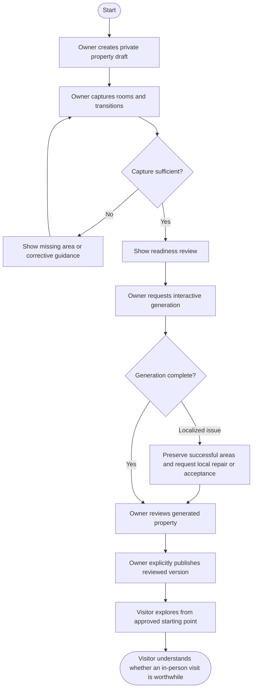
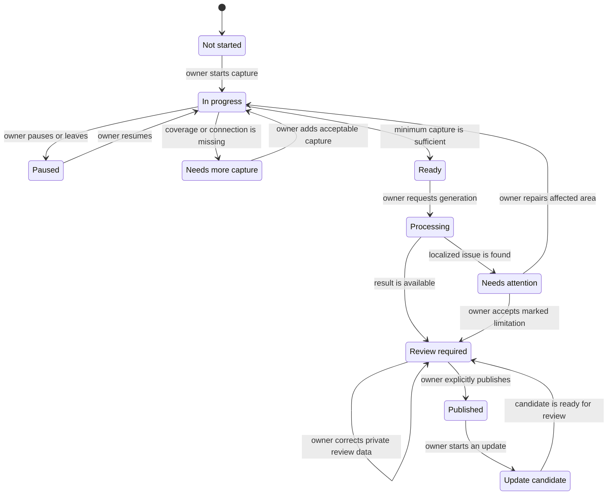
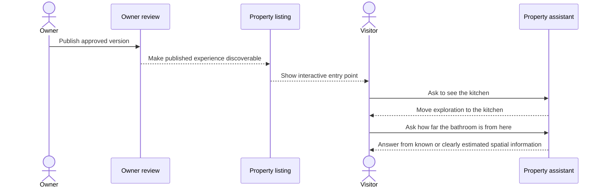
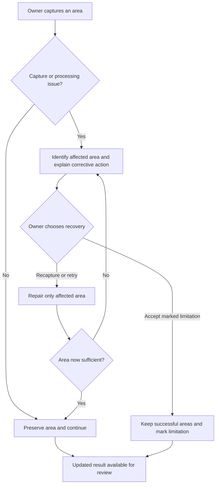

# Proposal: Interactive Property Exploration

## 1. Overview

### Product intent

Allow a property owner or agent to turn a guided set of property captures into an interactive experience that visitors can explore remotely.

### Problem

Ordinary property photos and listing text do not reliably communicate how rooms connect, how a visitor moves through the property, or whether the space fits a visitor's practical needs.

### Expected outcome

An owner can capture, review, correct, and explicitly publish an interactive property experience. A visitor can use the published experience to understand the property's appearance, structure, connectivity, and available spatial information before deciding whether to visit in person.

### Work type and preservation boundary

This is new behavior. Conventional listing information, including photos, description, price, location, facilities, and dimensions, remains available and is not replaced by the interactive experience.

### Core success condition

A visitor can explore a published property, identify their current room and floor, move between meaningful destinations, inspect available property information, and distinguish verified, estimated, generated, and unknown information without being shown fabricated areas.

## 2. Actors and authority

### Property owner or agent

The owner creates the property, captures spaces, supplies listing information, reviews generated results and visitor issue reports, corrects room identities and metadata, reviews privacy findings, publishes or unpublishes the experience, and prepares revisions. The owner is the final authority for room names, listing metadata, publication, and whether flagged private content remains visible.

### Property visitor

The visitor opens the listing, explores the published experience, uses available navigation and spatial tools, asks property questions, and may report an issue. The visitor cannot change the property or publish a revision.

### System

The system guides capture, evaluates capture quality and coverage, preserves progress, processes accepted captures, presents review findings, supports navigation, labels uncertainty, and prevents unsupported content from being presented as fact. System detections and generated suggestions remain suggestions until the owner confirms them.

## 3. Scope and non-goals

### In scope

- Creating a private property draft and progressively completing listing information.
- Guided room-by-room or area-by-area capture, including doorways and connections between spaces.
- Evaluation of existing property photos as supplemental capture when they contain useful information.
- Early feedback for blurry, dark, duplicated, insufficiently overlapping, or otherwise unusable captures.
- Resuming interrupted capture sessions without losing completed rooms or known missing areas.
- Processing accepted captures into an interactive representation while preserving successful areas when one area fails.
- Owner review of room names, floors, connections, navigation, visual artifacts, privacy concerns, and listing consistency.
- Explicit publication, unpublication, and preparation of a reviewed replacement version.
- Visitor exploration through direct movement, room lists, floor navigation, and floor plans when available.
- Optional measurements, room dimensions, hotspots, an AI assistant, and visitor issue reports when the property contains enough information. Each optional capability is non-blocking for the core tour.

### Non-goals

- The system does not claim survey-grade measurement accuracy unless a measurement is separately verified.
- Processing completion does not publish a property automatically.
- The system does not invent or fabricate an uncaptured room, connection, measurement, or property answer.
- The proposal does not prescribe a reconstruction format, rendering technology, model, storage system, or deployment architecture.

### Deferred behavior

None. The optional capabilities above are in scope but non-blocking; no additional behavior is deferred.

### Unknown items requiring a decision

None. Any material product decision is resolved before this proposal is finalized.

## 4. End-to-end journey

### Journey steps

| ID | Actor trigger | System response | Actor-visible result |
|---|---|---|---|
| `J-01` | The owner creates a property. | The system creates a private draft and accepts available listing information. | The property is available for preparation but is not public. |
| `J-02` | The owner starts capture for a room or area. | The system explains the capture goal and gives simple, actionable guidance. | The owner can capture without needing reconstruction expertise. |
| `J-03` | The owner provides each capture. | The system evaluates quality, coverage, overlap, and space connections as early as possible. | The owner sees accepted areas, missing areas, and a corrective instruction when a capture is insufficient. |
| `J-04` | The owner pauses or returns after an interruption. | The system restores completed rooms, prior guidance, known connections, and remaining gaps. | The owner continues from the last meaningful point rather than restarting. |
| `J-05` | The owner requests generation after readiness review. | The system processes the property and reports meaningful progress. | The owner can leave and return while original captures remain preserved. |
| `J-06` | Processing completes or a localized issue is found. | The system presents the generated result and identifies affected areas without discarding successful areas. | The owner can recapture or accept the affected limitation and continue review. |
| `J-07` | The owner reviews the result. | The system allows corrections to names, floors, connections, metadata, privacy findings, and other reviewable information. | The owner remains the final authority before publication. |
| `J-08` | The owner explicitly publishes. | The system makes the reviewed version available from the listing. | Visitors can discover and enter the interactive property experience. |
| `J-09` | The visitor selects the interactive experience. | The system opens at the owner-approved starting location and shows location context and basic controls. | The visitor can begin exploring without a mandatory tutorial. |
| `J-10` | The visitor moves, selects a room, uses a floor plan, asks a question, or uses an available spatial tool. | The system navigates or answers using known property information and labels estimates or unknowns. | The visitor gains practical understanding without confusing generated or uncertain information with fact. |
| `J-11` | The owner prepares an update after publication. | The system creates a candidate version while the current published version remains available. | The owner can review and explicitly replace the published version only when satisfied. |
| `J-12` | The owner uploads existing property photos. | The system evaluates whether they can supplement the interactive result and identifies remaining capture gaps. | The owner understands which photos are useful and which areas still need guided capture. |
| `J-13` | The visitor reports an issue. | The system records the property and available room or location context for owner review. | The visitor sees that the report was received without changing the published property automatically. |

### Diagram J1 — Primary journey

```mermaid
flowchart TD
    start([Start]) --> draft["Owner creates private property draft"]
    draft --> capture["Owner captures rooms and transitions"]
    capture --> validate{"Capture sufficient?"}
    validate -->|No| guidance["Show missing area or corrective guidance"]
    guidance --> capture
    validate -->|Yes| ready["Show readiness review"]
    ready --> process["Owner requests interactive generation"]
    process --> result{"Generation complete?"}
    result -->|Localized issue| repair["Preserve successful areas and request local repair or acceptance"]
    repair --> review["Owner reviews generated property"]
    result -->|Yes| review
    review --> publish["Owner explicitly publishes reviewed version"]
    publish --> explore["Visitor explores from approved starting point"]
    explore --> understand([Visitor understands whether an in-person visit is worthwhile])
```

## 5. Capability contracts

### `CAP-001` — Create a private, progressively completed property

- **Status:** Required.
- **Trigger:** The owner submits a new property with any available listing information.
- **Actor-visible outcome:** The system creates a private property draft and shows which information is present, missing, or still editable.
- **Boundary:** A draft is prepared for capture but is not publicly discoverable until explicit publication.
- **Failure handling:** Invalid information remains uncommitted with a clear correction message; valid information is preserved when only another field is invalid.

### `CAP-002` — Capture a room with actionable guidance

- **Status:** Required.
- **Trigger:** The owner starts or resumes capture for a room or area.
- **Actor-visible outcome:** The system gives plain-language instructions, shows current coverage, identifies remaining areas, and supports capture of the doorway or transition.
- **Boundary:** The owner may name or rename a room before publication; the system may suggest an identity but does not make the owner accept it.
- **Failure handling:** When a capture is too blurry, dark, redundant, distant, or lacking overlap, the system explains the reason and requests a corrective capture of the affected area.

### `CAP-003` — Preserve capture quality, coverage, and connections

- **Status:** Required.
- **Trigger:** A capture is received or a room is marked complete.
- **Actor-visible outcome:** The owner sees whether the room has minimum sufficient coverage, recommended additional coverage, and understandable connections to neighboring spaces.
- **Boundary:** A visually complete room is not marked fully ready when a required connection remains unclear.
- **Failure handling:** The system identifies the affected room or connection instead of requiring a whole-property restart.

### `CAP-004` — Resume capture with preserved progress

- **Status:** Required.
- **Trigger:** The owner pauses, leaves, or returns after an interrupted capture session.
- **Actor-visible outcome:** Completed rooms, prior guidance, discovered relationships, and remaining gaps are restored.
- **Boundary:** Resuming does not erase accepted captures or force recapture of unaffected rooms.
- **Failure handling:** If saved progress cannot be restored, the system explains what is unavailable and preserves any recoverable captures for review.

### `CAP-005` — Generate an interactive property with localized recovery

- **Status:** Required.
- **Trigger:** The owner requests generation after reviewing readiness.
- **Actor-visible outcome:** The system shows meaningful processing stages and presents a reviewable interactive result when processing completes.
- **Boundary:** A failure in one room does not remove successfully generated rooms when they can be preserved.
- **Failure handling:** The system names the affected area, explains an actionable cause when known, and offers local recapture, retry, or acceptance of a clearly marked limitation.

### `CAP-006` — Review, correct, and explicitly publish a version

- **Status:** Required.
- **Trigger:** A generated result is ready for owner review.
- **Actor-visible outcome:** The owner can inspect appearance, names, floors, connections, navigation, metadata, visual artifacts, and flagged private content, then publish only after an explicit action.
- **Boundary:** Processing completion alone never changes public visibility.
- **Failure handling:** Conflicting listing data or unresolved review findings remain visible for correction or explicit owner decision; the system does not silently overwrite authoritative owner data.

### `CAP-007` — Explore the published property

- **Status:** Required.
- **Trigger:** A visitor opens the listing and selects the interactive experience.
- **Actor-visible outcome:** The visitor starts at an approved location, can look around, move through valid areas, see current room and floor context, and return to the starting point.
- **Boundary:** Navigation never presents an uncaptured area as a real property space; guided navigation may replace unreliable free movement.
- **Failure handling:** An unavailable area is clearly labeled and the visitor is offered another valid destination.

### `CAP-008` — Navigate by rooms and floors

- **Status:** Required when the published property contains multiple rooms or floors.
- **Trigger:** The visitor selects a room, floor, or available floor-plan destination.
- **Actor-visible outcome:** The system moves the visitor to a meaningful position and keeps the selected room, floor, and relationships understandable.
- **Boundary:** The capability is absent or reduced when the property lacks reliable room or floor information; the core experience remains usable.
- **Failure handling:** If a destination cannot be reached reliably, the system explains that limitation and leaves the visitor at a valid location.

### `CAP-009` — Present spatial information with uncertainty

- **Status:** Optional.
- **Trigger:** The visitor requests an available measurement, room dimension, hotspot, or spatial comparison.
- **Actor-visible outcome:** The system presents the value and labels it as verified, owner-provided, estimated, inferred, or unavailable.
- **Boundary:** The system does not present an estimate as survey-grade or answer a question requiring information the property does not contain.
- **Failure handling:** Insufficient spatial information produces an explicit unknown response rather than a fabricated value.

### `CAP-010` — Assist exploration with property-aware questions and navigation

- **Status:** Optional.
- **Trigger:** The visitor asks a property question or requests navigation in natural language.
- **Actor-visible outcome:** The assistant answers from known property information, performs the requested navigation when a matching destination exists, or produces a clearly labeled hypothetical visualization when that optional capability is available, using the visitor's current room as context.
- **Boundary:** Generated answers, estimates, and visualizations remain distinguishable from the original property and verified data.
- **Failure handling:** The assistant states when information is unknown or confidence is insufficient and does not invent an answer or destination.

### `CAP-011` — Prepare and review a replacement version

- **Status:** Required when the owner updates a published property.
- **Trigger:** The owner captures a renovation, added room, correction, or improved area.
- **Actor-visible outcome:** The system creates a candidate version that can be reviewed beside the currently published version.
- **Boundary:** The currently published version remains available until the owner explicitly publishes the candidate; unpublishing does not delete the underlying property data.
- **Failure handling:** A failed candidate remains separate from the published version and identifies the affected area for repair.

### `CAP-012` — Supplement guided capture with existing photos

- **Status:** Optional.
- **Trigger:** The owner uploads existing property photos during preparation.
- **Actor-visible outcome:** The system reports which photos can supplement the interactive result and identifies rooms or connections that still need guided capture.
- **Boundary:** Existing photos do not automatically count as sufficient spatial capture merely because they are valid property photos.
- **Failure handling:** Unsupported or unhelpful photos are identified with a reason, while accepted photos remain available for the owner to review.

### `CAP-013` — Report a visitor issue

- **Status:** Optional.
- **Trigger:** A visitor reports an incorrect label, broken navigation, visual artifact, incorrect property information, privacy concern, or measurement problem.
- **Actor-visible outcome:** The system records the property and, when possible, the relevant room or location for owner review.
- **Boundary:** A visitor report does not directly alter the published property or replace owner authority.
- **Failure handling:** If a precise room or location cannot be identified, the system retains a property-level report rather than discarding the feedback.

## 6. State model and transitions

### User-visible states

| ID | State | Meaning |
|---|---|---|
| `STATE-01` | Not started | The property exists but capture has not begun. |
| `STATE-02` | In progress | Capture or correction is active. |
| `STATE-03` | Paused | The owner stopped and can resume later. |
| `STATE-04` | Needs more capture | The system identified missing, poor, or disconnected information. |
| `STATE-05` | Ready | The property meets the minimum readiness boundary for generation. |
| `STATE-06` | Processing | The requested interactive result is being prepared. |
| `STATE-07` | Needs attention | Processing or review identified an affected area requiring repair or an explicit decision. |
| `STATE-08` | Review required | A generated result is available but not public. |
| `STATE-09` | Published | An owner-approved version is available to visitors. |
| `STATE-10` | Update candidate | A replacement version is being prepared while the published version remains available. |

### Material transitions

| From | Trigger | To | Visible result |
|---|---|---|---|
| `STATE-01` | Owner starts capture. | `STATE-02` | Guidance and capture progress appear. |
| `STATE-02` | Owner pauses or leaves. | `STATE-03` | Progress is saved and resumable. |
| `STATE-03` | Owner resumes. | `STATE-02` | Previous guidance and remaining gaps reappear. |
| `STATE-02` | Required coverage or connection is missing. | `STATE-04` | The affected room or area is identified. |
| `STATE-04` | Owner supplies acceptable additional capture. | `STATE-02` or `STATE-05` | The gap closes or the property becomes ready. |
| `STATE-05` | Owner requests generation. | `STATE-06` | Processing stages and leave-and-return behavior appear. |
| `STATE-06` | Processing succeeds. | `STATE-08` | The owner can review a non-public result. |
| `STATE-06` | A localized issue is found. | `STATE-07` | The affected area and recovery choices appear. |
| `STATE-07` | Owner repairs the area. | `STATE-06` or `STATE-08` | Processing resumes or review becomes available. |
| `STATE-08` | Owner corrects reviewable information. | `STATE-08` | Changes remain private until publication. |
| `STATE-08` | Owner explicitly publishes. | `STATE-09` | The reviewed version becomes discoverable. |
| `STATE-09` | Owner starts an update. | `STATE-10` | A separate candidate is created without replacing the published version. |
| `STATE-10` | Candidate processing completes. | `STATE-08` | The candidate is available for review and explicit replacement. |

### Diagram S1 — User-visible lifecycle

```mermaid
stateDiagram-v2
    state "Not started" as NotStarted
    state "In progress" as InProgress
    state "Paused" as Paused
    state "Needs more capture" as NeedsMoreCapture
    state "Ready" as Ready
    state "Processing" as Processing
    state "Needs attention" as NeedsAttention
    state "Review required" as ReviewRequired
    state "Published" as Published
    state "Update candidate" as UpdateCandidate

    [*] --> NotStarted
    NotStarted --> InProgress: owner starts capture
    InProgress --> Paused: owner pauses or leaves
    Paused --> InProgress: owner resumes
    InProgress --> NeedsMoreCapture: coverage or connection is missing
    NeedsMoreCapture --> InProgress: owner adds acceptable capture
    InProgress --> Ready: minimum capture is sufficient
    Ready --> Processing: owner requests generation
    Processing --> ReviewRequired: result is available
    Processing --> NeedsAttention: localized issue is found
    NeedsAttention --> InProgress: owner repairs affected area
    NeedsAttention --> ReviewRequired: owner accepts marked limitation
    ReviewRequired --> ReviewRequired: owner corrects private review data
    ReviewRequired --> Published: owner explicitly publishes
    Published --> UpdateCandidate: owner starts an update
    UpdateCandidate --> ReviewRequired: candidate is ready for review
```

## 7. Cross-experience interactions

### `INT-001` — Capture to processing

The owner submits a readiness request; the capture experience transfers accepted captures, coverage findings, room identities, and connection findings to processing. The system acknowledges the request by showing the processing state and preserving the original captures.

### `INT-002` — Processing to owner review

Processing transfers the generated result, affected-area findings, and uncertainty markers to owner review. The review experience acknowledges which areas are ready, need attention, or remain unavailable.

### `INT-003` — Owner publication to visitor listing

The owner publishes an approved version; the listing makes the interactive entry point discoverable while retaining conventional listing information. The listing does not expose a draft or candidate version.

### `INT-004` — Visitor exploration to assistant

The visitor sends a question or navigation request; the assistant receives the current room, floor, orientation when available, published property information, and known spatial relationships. The exploration experience visibly changes when the assistant performs navigation and identifies uncertainty when it only answers approximately.

### `INT-005` — Visitor feedback to owner review

The visitor submits an issue; the system transfers the property and available room or location context to owner review and acknowledges that the report was received. The report does not change the published version automatically.

### Diagram I1 — Owner publication and visitor exploration

```mermaid
sequenceDiagram
    actor Owner
    participant Review as Owner review
    participant Listing as Property listing
    actor Visitor
    participant Assistant as Property assistant

    Owner->>Review: Publish approved version
    Review-->>Listing: Make published experience discoverable
    Listing-->>Visitor: Show interactive entry point
    Visitor->>Assistant: Ask to see the kitchen
    Assistant-->>Visitor: Move exploration to the kitchen
    Visitor->>Assistant: Ask how far the bathroom is from here
    Assistant-->>Visitor: Answer from known or clearly estimated spatial information
```

## 8. Information, truth, and uncertainty

| Information class | Authority and presentation |
|---|---|
| Owner-provided listing information | The owner's reviewed values are authoritative for listing metadata unless the owner changes them. Conflicts with generated observations are shown for review rather than silently overwritten. |
| Verified measurement or property fact | Presented as verified only when the verification source is part of the property record. |
| System-detected room, floor, connection, or private content | A suggestion or finding until the owner reviews it. |
| Estimated or inferred dimension, distance, or spatial answer | Clearly labeled as estimated or inferred, including when an assistant uses it to answer. |
| AI-generated visualization | Labeled as a hypothetical visualization and never shown as the original property condition. |
| Unknown or unsupported information | Stated as unknown or unavailable; the system does not fill the gap with plausible invention. |
| Original captured or published property | Remains the factual reference that a visualization or candidate version can be compared against. |

The assistant uses known listing data and the current exploration context when answering. It performs navigation when a request maps to a valid destination; otherwise it explains the limitation instead of claiming that it acted.

## 9. Validation, review, finalization, and revision

### Capture validation

The system checks each incoming capture for quality, useful overlap, redundant viewpoints, coverage, and room transitions. A rejected capture includes the reason and a corrective action. Validation findings are attached to the affected room or connection, not generalized to the entire property.

### Readiness review

Before generation, the owner sees each room's readiness, missing areas, recommended additional views, and unresolved connections. The owner may continue capture, remove or replace problematic images, or accept a clearly explained limitation when the product allows it.

### Generated-result review

Before publication, the owner can explore the result as a visitor would and review room appearance, labels, floor assignments, connections, navigation, metadata, privacy flags, and visual artifacts. Suggested identities and flagged content remain editable.

### Finalization and publication

The owner must explicitly publish a reviewed version. Processing completion, opening the review screen, or correcting a field never publishes automatically. The owner can unpublish the experience later without deleting the property data.

### Revision

An update creates a candidate version. The current published version remains available while the candidate is processed and reviewed. Only explicit publication of the candidate replaces the current public version; a failed candidate does not damage the published version.

## 10. Failure and recovery

### `REC-001` — Unusable capture

When a capture is blurry, dark, redundant, too distant, or lacking overlap, the system rejects or flags it with the reason and an actionable instruction. The owner recaptures the same area while accepted captures remain intact.

### `REC-002` — Interrupted session

When capture is interrupted, the system preserves completed rooms, previous guidance, connections, and remaining gaps. On resume, the owner returns to the saved progress; the system does not require a full restart.

### `REC-003` — Localized processing failure

When one room or connection cannot be reconstructed reliably, the system identifies it and preserves successful areas. The owner may recapture the affected area, retry, or accept a clearly marked limitation when permitted. The rest of the property remains reviewable.

### `REC-004` — Conflicting property information

When generated observations conflict with owner-provided listing data, the system presents the conflict for owner review and retains the existing authoritative value until the owner chooses a correction. No source is silently overwritten.

### `REC-005` — Visitor reaches an unavailable area

When a visitor selects or reaches an area without sufficient capture, the system says that the area is unavailable in the virtual tour and offers a valid alternate destination. It does not render fabricated content.

### Diagram R1 — Localized failure and recovery

```mermaid
flowchart TD
    capture["Owner captures an area"] --> detect{"Capture or processing issue?"}
    detect -->|No| continue["Preserve area and continue"]
    detect -->|Yes| explain["Identify affected area and explain corrective action"]
    explain --> choice{"Owner chooses recovery"}
    choice -->|Recapture or retry| repair["Repair only affected area"]
    repair --> validate{"Area now sufficient?"}
    validate -->|No| explain
    validate -->|Yes| continue
    choice -->|Accept marked limitation| limited["Keep successful areas and mark limitation"]
    continue --> review["Updated result available for review"]
    limited --> review
```

## 11. Edge cases and quality expectations

- **Optional capability unavailable:** If a property lacks a floor plan, reliable measurements, hotspots, assistant-ready information, or issue-reporting detail, the remaining listing and interactive navigation continue without presenting the missing capability as broken.
- **Privacy:** Potential faces, documents, screens, license plates, and personal identifiers are flagged when detectable. The owner can hide, replace, remove, or leave each item after review, and publication remains explicit.
- **Mobile visitors:** Visitors can look around, move, select rooms, change floors, inspect listing information, use available tools, and ask questions on a mobile device; controls remain usable without requiring a desktop-only interaction.
- **Lower-performance devices:** When maximum visual quality is unavailable, the system reduces visual detail while preserving room identity, navigation, property structure, and available information, and tells the visitor when quality is reduced.
- **Slow connection:** Useful listing and exploration content becomes available progressively; the visitor sees which higher-detail content is still loading and is not trapped behind an all-assets loading screen.
- **Accessibility:** Important controls, room and floor context, validation findings, privacy warnings, and uncertainty labels are available in an understandable non-visual form where the experience supports it.
- **Permissions:** Only an owner or authorized agent can edit, publish, unpublish, or replace a property version; visitors can only explore and report issues.
- **Measurement limits:** The interface labels approximate measurements and declines questions that require unavailable precision.
- **Listing consistency:** The interactive experience does not present a detected room identity as confirmed when it conflicts with reviewed listing information.
- **Interruption and retry:** Leaving the owner workflow, losing a connection, or retrying a localized operation does not discard already accepted progress.

## 12. Final expected experience and success criterion

### Owner experience

The owner should feel: "I can walk through the property while the system tells me what is missing, return later without losing progress, inspect the generated result, correct what it misunderstood, and decide exactly when a version becomes public."

### Visitor experience

The visitor should feel: "I can enter the property virtually, understand where I am and how rooms connect, move directly to relevant rooms, inspect practical details, ask questions, and tell which information is verified, estimated, generated, or unavailable."

### Product success criterion

The product succeeds when a visitor can use a published property experience to understand its appearance, room structure, connectivity, and practical spatial characteristics with materially more confidence than ordinary listing photos and text provide, while the owner remains in control of correctness, privacy, revisions, and publication.
