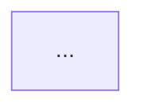
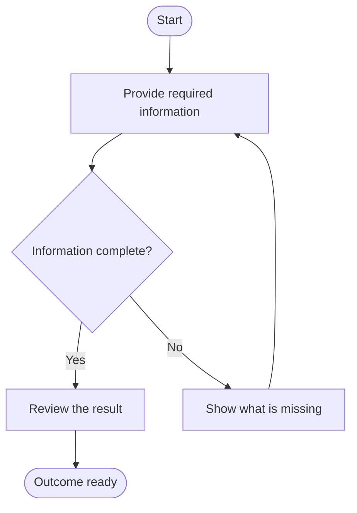
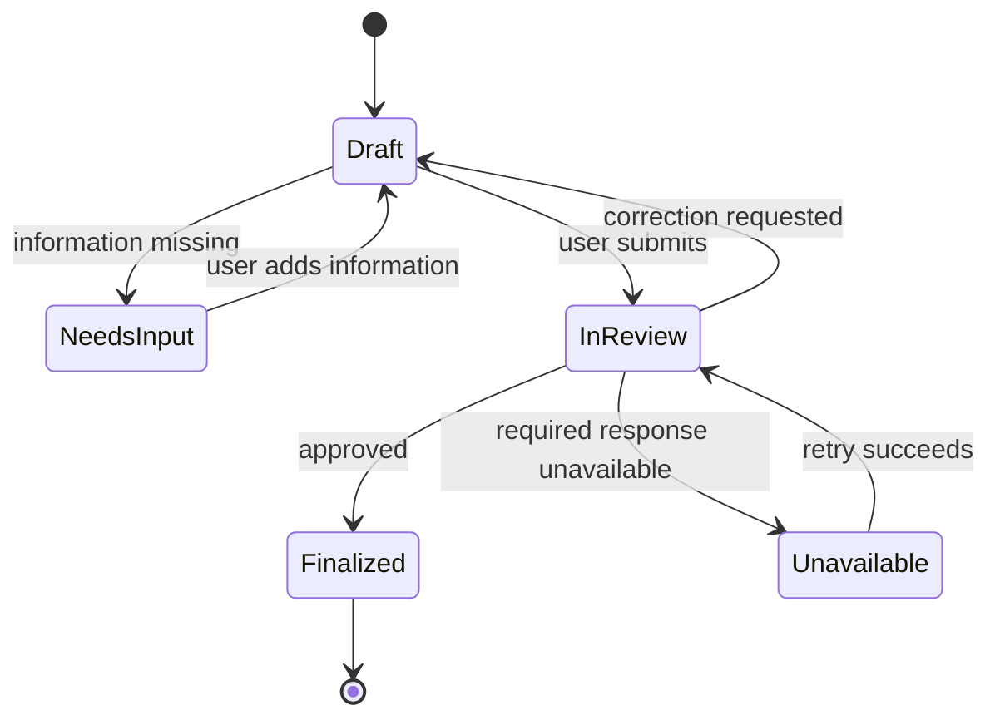
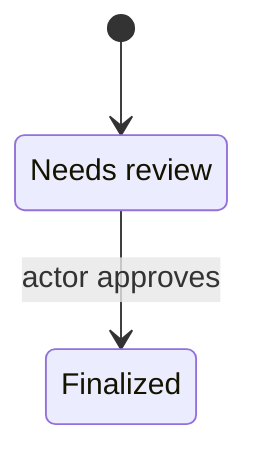
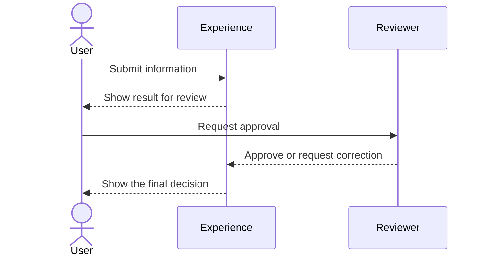

# Mermaid Diagrams

Mermaid diagrams are part of the proposal's product contract. They make journeys, states, hand-offs, and recovery paths inspectable, but they never replace the surrounding behavioral prose.

## Required diagram set

Every proposal includes the journey and state diagrams. Add the interaction and recovery diagrams when their conditions apply:

1. **Primary journey (`J1`)** — a `flowchart TD` from entry to the successful product outcome, including meaningful decisions and user-visible non-success branches.
2. **State transitions (`S1`)** — a `stateDiagram-v2` for the user-visible states and material transitions.
3. **Interaction diagram (`I1`)** — a `sequenceDiagram` when order or timing between actors or experience areas matters, or a `flowchart LR` when a relationship map is clearer. Omit it only when the proposal explicitly says cross-experience interaction is not applicable.
4. **Failure and recovery (`R1`, `R2`, ...)** — a focused `flowchart TD` for each materially different recovery boundary, or one diagram when several failure causes share one recovery path. If no meaningful non-success path can affect the product outcome, section 10 must say why and mark the recovery diagram not applicable rather than inventing a failure.

If a proposal contains multiple independent journeys, add a focused journey diagram for each independent outcome rather than making `J1` unreadably large. Keep the primary diagram focused on the main outcome.

## Diagram responsibilities

A diagram should answer one product question:

| Diagram | Question it answers | Required content |
|---|---|---|
| `J1` | How does the primary user reach the intended outcome? | Entry, meaningful actions, responses, decisions, success, relevant detours |
| `S1` | What state is the experience in and how does it change? | Initial state, user-visible states, triggers, success, incomplete/failure/recovery paths |
| `I1` | Who hands what to whom, and in what order? | Product actors or experience areas, transferred information or decision, acknowledgement, delay/rejection behavior |
| `R1` | What happens when an operation does not complete? | Failure cause, preserved progress, user choice, retry/correction loop, recovered or unrecoverable outcome |

Do not use one diagram to answer all four questions. A compact set of focused diagrams is clearer than a single graph with every detail.

## Diagram placement and captions

Place each diagram next to the prose or table it explains. Use a descriptive caption heading before the code block:

````markdown
### Diagram J1 — Primary journey: submit and review


````

Use the stable diagram ID in surrounding prose when referring to it. Do not put a diagram ID in a user-facing label unless that ID helps the product reader understand the flow.

The code block must use exactly the `mermaid` language tag. Do not put a Mermaid block inside another Mermaid block, and do not wrap the complete proposal in a code fence.

## Supported diagram types

Use only the smallest diagram type that expresses the product behavior:

- `flowchart TD` for journeys, decisions, recovery, and state-oriented relationship maps;
- `flowchart LR` for hand-off or relationship maps where left-to-right reading is useful;
- `stateDiagram-v2` for persistent user-visible states and transitions;
- `sequenceDiagram` for time-ordered interactions between product actors or experience areas.

Do not use `classDiagram`, `erDiagram`, infrastructure topology, deployment graphs, or component diagrams for ordinary product proposals. Those formats encourage technical design decisions. Use a product-level flow or state diagram instead. A different Mermaid type is allowed only when the product idea itself is explicitly about that visual relationship and the diagram remains observable and implementation-agnostic.

## Portable syntax

Use syntax supported by common Mermaid 10+ renderers. Prefer plain text, simple shapes, and explicit labels over styling or renderer-specific features.

### Flowcharts

Use semantic ASCII node IDs and quoted labels for readable text:

````markdown

````

Rules:

- use `flowchart TD` for top-to-bottom process and `flowchart LR` for left-to-right hand-offs;
- use short, stable IDs such as `start`, `review`, `needs_input`, and `ready`; IDs must be unique within the diagram;
- use `[]` for an action or visible step, `{}` for a decision, and `()` or `([])` for a start or terminal point;
- put readable labels in the node rather than exposing the ID;
- label every decision branch with the observable condition or outcome (`Yes`, `No`, `Retry`, `Cancel`, `Approved`, and so on);
- use one arrow for one meaningful transition; split compound actions into separate nodes when the user sees separate results;
- avoid long paragraphs inside nodes; move detail into the surrounding step table or capability contract.

### State diagrams

Use `stateDiagram-v2` and give the user-visible states readable names:

````markdown

````

Rules:

- include `[ * ]` as the initial entry and a terminal path when the experience has a final state;
- use state names that describe what the actor can observe or do, not internal flags such as `WorkerRunning` or `DatabasePending`;
- put the trigger or condition after the colon on every material transition;
- show incomplete, needs-review, failed, recovered, revised, or cancelled states when they affect the user;
- do not create a state for every click or transient animation; use a state only when the user's available actions or understanding changes.

If a state label needs spaces or punctuation, use an alias rather than a complicated identifier:

````markdown

````

### Sequence diagrams

Use product actors and experience areas, not internal modules:

````markdown

````

Rules:

- use `actor` for a human role and `participant` for a product-facing experience area;
- describe messages as observable actions, information, or decisions, not method names or protocol calls;
- show the acknowledgement or visible effect after a hand-off;
- show delays, rejections, retries, or correction requests when they materially change the journey;
- keep the number of participants small and split unrelated interactions into another diagram.

## Naming and labels

Use stable product vocabulary consistently across prose, tables, and diagrams. A diagram must not rename a capability, state, or actor without an explicit reason.

Use labels that answer one of these questions:

- what did the actor do?
- what did the system show or change?
- what condition caused the branch?
- what information or decision crossed the boundary?
- what can the actor do to recover?

Prefer `Show missing information` over `ValidateInput()`. Prefer `Reviewer requests correction` over `POST /review`. Prefer `Outcome ready` over `SuccessState`.

Keep node IDs and state aliases ASCII. Avoid unescaped brackets, braces, pipes, quotes, colons, and newlines inside labels. When punctuation is needed, use a quoted label and verify that the resulting block remains parseable. Never use a pipe character inside a branch label because Mermaid uses it as the label delimiter.

Do not use color, line style, font size, or shape alone to communicate meaning. A reader should understand the path from the words and arrows in a plain renderer or a text alternative.

## Granularity and composition

A useful diagram is a map, not a transcript. Apply these rules:

- one node represents one meaningful user-visible action, result, decision, or state;
- split a node when it contains two independently reviewable outcomes or two different recovery paths;
- keep closely inseparable micro-steps together when the user sees them as one outcome;
- target roughly 5–12 flowchart nodes for a focused diagram;
- if a diagram needs more than about 15 meaningful nodes, split it by journey stage, actor boundary, or recovery boundary;
- do not repeat every capability-contract sentence in a node;
- do not omit a branch merely to make the diagram smaller; split the diagram or label the branch as out of scope.

Use subgraphs only to group product-facing stages or actors. Do not use subgraphs to imply technical layers, deployment zones, or internal architecture.

## Semantic consistency

Before finalizing a diagram, compare it with the proposal text:

1. every node and edge has a corresponding statement in a journey step, capability contract, state table, interaction row, or recovery scenario;
2. every material branch in the prose appears in the relevant diagram;
3. the same actor, state, capability, and outcome names are used consistently;
4. the success path reaches the success state named in the final experience;
5. recovery paths preserve exactly the progress promised in the failure section;
6. the diagram does not imply authority, automation, data, or optional behavior that the proposal never defines;
7. the state diagram and journey diagram agree about the state before and after each major transition.

A diagram is not allowed to resolve ambiguity by choosing a path the prose did not decide. Resolve the product decision first.

## Diagram validation checklist

Run this checklist after assembling the proposal:

- [ ] Every required diagram has a ` ```mermaid ` opening fence and a matching closing fence.
- [ ] The first non-empty line is one of the supported diagram declarations.
- [ ] Every diagram has a unique stable ID in its heading.
- [ ] Node IDs, state aliases, and participant names are unique within their diagram.
- [ ] Flowchart decisions have labeled branches.
- [ ] The journey has an entry and an explicit successful outcome.
- [ ] The state diagram has an initial transition and all material user-visible states.
- [ ] Interaction diagrams show acknowledgement or visible effects, not just messages.
- [ ] Recovery diagrams show preserved progress, user choice, and recovered or unrecoverable outcomes.
- [ ] No diagram relies on color, a renderer-specific plugin, an external URL, or a hidden legend.
- [ ] No node or transition introduces behavior absent from the proposal prose.
- [ ] Diagram labels are concise, English, and free of implementation details unless the user explicitly made a technical constraint part of the product behavior.

If a Mermaid renderer is available, render every block before completion. If no renderer is available, perform the structural and semantic checks above; do not claim visual rendering was verified.
